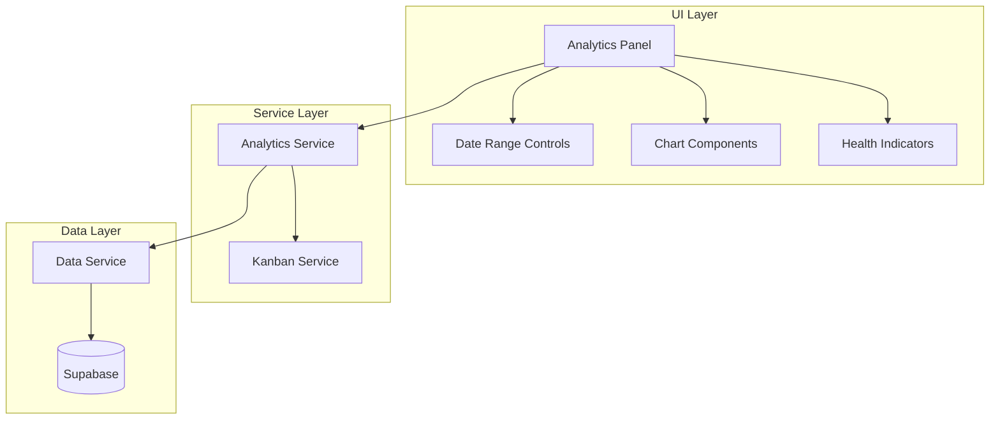

# Design Document: Board Analytics

## Overview

The Board Analytics feature provides a comprehensive analytics dashboard for Kanban boards, enabling users to track productivity metrics, identify workflow bottlenecks, and visualize throughput patterns. The system calculates metrics from existing `kanban_cards` and `kanban_activity_log` tables, presenting data through interactive Chart.js-based visualizations with date range filtering.

The design follows the existing application patterns:
- Vanilla JavaScript with ES6 modules
- Supabase for data persistence
- Chart.js for visualizations (consistent with mobile-app chart components)
- CSS following the existing theme system

## Architecture



### Data Flow

1. User opens analytics panel from Kanban board view
2. Analytics Panel requests metrics from Analytics Service with date range
3. Analytics Service queries Data Service for cards and activity logs
4. Data Service fetches from Supabase with appropriate filters
5. Analytics Service calculates metrics and returns structured data
6. Analytics Panel renders charts and indicators using Chart.js

## Components and Interfaces

### Analytics Service (`js/analytics-service.js`)

The core service responsible for calculating all analytics metrics.

```javascript
/**
 * @typedef {Object} DateRange
 * @property {Date} startDate - Start of the date range
 * @property {Date} endDate - End of the date range
 */

/**
 * @typedef {Object} CompletionMetrics
 * @property {number} totalCompleted - Total cards completed in range
 * @property {number} totalCreated - Total cards created in range
 * @property {number} completionRate - Percentage (0-100)
 * @property {number} avgCompletionTimeMs - Average time to complete in milliseconds
 * @property {Object} byPriority - Cards grouped by priority {high, medium, low, none}
 * @property {Array<{date: string, count: number}>} dailyCompletions - Daily completion counts
 */

/**
 * @typedef {Object} CycleTimeMetrics
 * @property {number} avgCycleTimeMs - Average cycle time in milliseconds
 * @property {Array<{columnId: string, columnTitle: string, avgTimeMs: number}>} columnTimes
 * @property {Array<{date: string, avgTimeMs: number}>} trends - Cycle time over time
 * @property {Array<string>} bottleneckColumnIds - Columns exceeding 1.5x average
 */

/**
 * @typedef {Object} ThroughputMetrics
 * @property {Array<{date: string, columns: Object<string, number>}>} cumulativeFlow
 * @property {Array<{date: string, created: number, completed: number}>} createdVsCompleted
 * @property {Array<{date: string, wip: number}>} wipTrends
 * @property {Array<{date: string, remaining: number}>} burndown
 * @property {Array<{date: string, total: number, completed: number}>} burnup
 */

/**
 * @typedef {Object} BoardHealthMetrics
 * @property {number} overdueCount - Cards past due date
 * @property {number} staleCount - Cards with no recent activity
 * @property {number} wipViolationCount - Columns over WIP limit
 * @property {Array<{id: string, title: string}>} overdueCards - List of overdue cards
 * @property {Array<{id: string, title: string}>} staleCards - List of stale cards
 * @property {Array<{id: string, title: string, current: number, limit: number}>} wipViolations
 */

/**
 * @typedef {Object} BoardAnalytics
 * @property {CompletionMetrics} completion
 * @property {CycleTimeMetrics} cycleTime
 * @property {ThroughputMetrics} throughput
 * @property {BoardHealthMetrics} health
 */

class AnalyticsService {
    /**
     * Get complete analytics for a board
     * @param {string} boardId - Board ID
     * @param {DateRange} dateRange - Date range for analysis
     * @returns {Promise<BoardAnalytics>}
     */
    async getBoardAnalytics(boardId, dateRange) {}
    
    /**
     * Get completion metrics
     * @param {string} boardId - Board ID
     * @param {DateRange} dateRange - Date range
     * @returns {Promise<CompletionMetrics>}
     */
    async getCompletionMetrics(boardId, dateRange) {}
    
    /**
     * Get cycle time metrics
     * @param {string} boardId - Board ID
     * @param {DateRange} dateRange - Date range
     * @returns {Promise<CycleTimeMetrics>}
     */
    async getCycleTimeMetrics(boardId, dateRange) {}
    
    /**
     * Get throughput metrics
     * @param {string} boardId - Board ID
     * @param {DateRange} dateRange - Date range
     * @returns {Promise<ThroughputMetrics>}
     */
    async getThroughputMetrics(boardId, dateRange) {}
    
    /**
     * Get board health metrics
     * @param {string} boardId - Board ID
     * @param {number} staleDaysThreshold - Days without activity to consider stale
     * @returns {Promise<BoardHealthMetrics>}
     */
    async getBoardHealthMetrics(boardId, staleDaysThreshold = 7) {}
    
    /**
     * Identify the "Done" column for a board
     * @param {Array} columns - Board columns
     * @returns {Object|null} Done column or null
     */
    findDoneColumn(columns) {}
    
    /**
     * Calculate time spent in each column from activity log
     * @param {string} cardId - Card ID
     * @param {Array} activityLog - Activity log entries
     * @returns {Object<string, number>} Column ID to time in ms
     */
    calculateColumnTimes(cardId, activityLog) {}
}
```

### Analytics Panel Component

The UI component for displaying analytics, integrated into the Kanban view.

```javascript
/**
 * @typedef {Object} AnalyticsPanelConfig
 * @property {string} boardId - Current board ID
 * @property {Function} onClose - Callback when panel is closed
 */

class AnalyticsPanel {
    /**
     * Initialize the analytics panel
     * @param {HTMLElement} container - Container element
     * @param {AnalyticsPanelConfig} config - Configuration
     */
    constructor(container, config) {}
    
    /**
     * Open the analytics panel
     */
    async open() {}
    
    /**
     * Close the analytics panel
     */
    close() {}
    
    /**
     * Set the date range and refresh data
     * @param {DateRange} dateRange
     */
    async setDateRange(dateRange) {}
    
    /**
     * Render all charts with current data
     * @param {BoardAnalytics} analytics
     */
    renderCharts(analytics) {}
    
    /**
     * Render health indicators
     * @param {BoardHealthMetrics} health
     */
    renderHealthIndicators(health) {}
}
```

### Chart Wrapper Components

Vanilla JavaScript wrappers for Chart.js, following patterns from mobile-app charts.

```javascript
/**
 * Line chart for trends (cycle time, throughput)
 */
class AnalyticsLineChart {
    constructor(canvas, options) {}
    update(data) {}
    destroy() {}
}

/**
 * Bar chart for completion metrics, priority breakdown
 */
class AnalyticsBarChart {
    constructor(canvas, options) {}
    update(data) {}
    destroy() {}
}

/**
 * Stacked area chart for cumulative flow diagram
 */
class AnalyticsAreaChart {
    constructor(canvas, options) {}
    update(data) {}
    destroy() {}
}
```

## Data Models

### Activity Log Entry Structure

The `kanban_activity_log` table stores card movements and changes:

```javascript
/**
 * @typedef {Object} ActivityLogEntry
 * @property {string} id - UUID
 * @property {string} card_id - Card UUID
 * @property {string} user_id - User UUID
 * @property {string} action_type - Type of action (e.g., 'moved', 'created', 'completed')
 * @property {Object} action_data - Additional data about the action
 * @property {string} action_data.from_column_id - Source column (for moves)
 * @property {string} action_data.to_column_id - Target column (for moves)
 * @property {string} created_at - ISO timestamp
 */
```

### Analytics Data Structures

```javascript
/**
 * Daily aggregation for charts
 * @typedef {Object} DailyDataPoint
 * @property {string} date - ISO date string (YYYY-MM-DD)
 * @property {number} value - Aggregated value
 */

/**
 * Column time breakdown
 * @typedef {Object} ColumnTimeData
 * @property {string} columnId - Column UUID
 * @property {string} columnTitle - Column display name
 * @property {number} avgTimeMs - Average time in milliseconds
 * @property {number} cardCount - Number of cards measured
 * @property {boolean} isBottleneck - Whether this column is a bottleneck
 */

/**
 * Cumulative flow data point
 * @typedef {Object} CumulativeFlowPoint
 * @property {string} date - ISO date string
 * @property {Object<string, number>} columnCounts - Column ID to card count
 */
```

### Date Range Presets

```javascript
const DATE_RANGE_PRESETS = {
    WEEK: { days: 7, label: 'Last 7 days' },
    MONTH: { days: 30, label: 'Last 30 days' },
    QUARTER: { days: 90, label: 'Last 90 days' },
    YEAR: { days: 365, label: 'Last year' }
};
```

## Algorithm Details

### Cycle Time Calculation

```javascript
/**
 * Calculate cycle time for a card
 * 
 * Cycle time = time from first entry into active column to completion
 * 
 * Algorithm:
 * 1. Find the first 'moved' activity where to_column_id is not backlog
 * 2. Find the 'completed' activity or move to Done column
 * 3. Return the difference in milliseconds
 * 
 * Edge cases:
 * - Card created directly in column (no move): use created_at
 * - Card never completed: use current time or exclude
 * - Card moved back from Done: use last move to Done
 */
function calculateCardCycleTime(card, activityLog, doneColumnId) {
    // Find first entry into active workflow
    const firstActiveEntry = activityLog.find(log => 
        log.action_type === 'moved' && 
        log.action_data.to_column_id !== null &&
        !log.action_data.is_backlog
    );
    
    const startTime = firstActiveEntry 
        ? new Date(firstActiveEntry.created_at)
        : new Date(card.created_at);
    
    // Find completion (last move to Done)
    const completionEntry = [...activityLog]
        .reverse()
        .find(log => 
            log.action_type === 'moved' && 
            log.action_data.to_column_id === doneColumnId
        );
    
    if (!completionEntry) {
        return null; // Not completed
    }
    
    const endTime = new Date(completionEntry.created_at);
    return endTime.getTime() - startTime.getTime();
}
```

### Bottleneck Detection

```javascript
/**
 * Identify bottleneck columns
 * 
 * A column is a bottleneck if:
 * avgColumnTime > 1.5 * boardAverageColumnTime
 * 
 * @param {Array<ColumnTimeData>} columnTimes
 * @returns {Array<string>} Bottleneck column IDs
 */
function identifyBottlenecks(columnTimes) {
    const totalTime = columnTimes.reduce((sum, ct) => sum + ct.avgTimeMs, 0);
    const avgTime = totalTime / columnTimes.length;
    const threshold = avgTime * 1.5;
    
    return columnTimes
        .filter(ct => ct.avgTimeMs > threshold)
        .map(ct => ct.columnId);
}
```

### Cumulative Flow Diagram Data

```javascript
/**
 * Generate cumulative flow diagram data
 * 
 * For each day in the range:
 * 1. Count cards in each column at end of day
 * 2. Include backlog and done columns
 * 
 * Uses activity log to reconstruct historical state
 */
function generateCumulativeFlowData(cards, activityLog, columns, dateRange) {
    const days = getDaysInRange(dateRange);
    const result = [];
    
    for (const day of days) {
        const dayEnd = new Date(day);
        dayEnd.setHours(23, 59, 59, 999);
        
        const columnCounts = {};
        columns.forEach(col => columnCounts[col.id] = 0);
        columnCounts['backlog'] = 0;
        
        // For each card, determine its column at end of day
        for (const card of cards) {
            if (new Date(card.created_at) > dayEnd) continue;
            
            const columnAtDay = getCardColumnAtDate(card, activityLog, dayEnd);
            if (columnAtDay) {
                columnCounts[columnAtDay]++;
            }
        }
        
        result.push({ date: day, columnCounts });
    }
    
    return result;
}
```


## Correctness Properties

*A property is a characteristic or behavior that should hold true across all valid executions of a system—essentially, a formal statement about what the system should do. Properties serve as the bridge between human-readable specifications and machine-verifiable correctness guarantees.*

Based on the prework analysis, the following properties have been consolidated to eliminate redundancy:

### Property 1: Card Counting Aggregation

*For any* set of cards with creation and completion timestamps, and *for any* date range, the Analytics_Service SHALL correctly count:
- Cards completed per day/week/month within the range
- Cards created per day within the range
- Remaining cards (total - completed) at each point in time
- Cumulative totals for burnup charts

**Validates: Requirements 1.1, 3.2, 3.4, 3.5**

### Property 2: Completion Rate Calculation

*For any* set of cards where some are completed and some are not, the completion rate SHALL equal `(completedCount / totalCount) * 100`, rounded appropriately, and SHALL be between 0 and 100 inclusive.

**Validates: Requirements 1.2**

### Property 3: Average Completion Time

*For any* set of completed cards with known creation and completion timestamps, the average completion time SHALL equal the arithmetic mean of all individual completion times (completion_date - created_at).

**Validates: Requirements 1.3**

### Property 4: Priority Grouping

*For any* set of cards with various priority values (high, medium, low, null), grouping by priority SHALL produce counts that sum to the total card count, and each card SHALL appear in exactly one group.

**Validates: Requirements 1.4**

### Property 5: Column Time Calculation

*For any* card with activity log entries recording column movements, the time spent in each column SHALL equal the sum of durations between entering and leaving that column. The total time across all columns SHALL equal the card's total lifecycle time.

**Validates: Requirements 2.1, 2.2**

### Property 6: Bottleneck Detection

*For any* set of column time averages, a column SHALL be flagged as a bottleneck if and only if its average time exceeds 1.5 times the mean of all column averages.

**Validates: Requirements 2.4**

### Property 7: Cumulative Flow Consistency

*For any* point in time within the date range, the sum of cards across all columns (including backlog and done) SHALL equal the total number of cards that existed at that point in time.

**Validates: Requirements 3.1, 3.3**

### Property 8: Overdue Card Detection

*For any* card with a due_date, the card SHALL be counted as overdue if and only if: (1) due_date < current_date, AND (2) the card is not in the Done column.

**Validates: Requirements 4.1**

### Property 9: Stale Card Detection

*For any* card and activity log, the card SHALL be counted as stale if and only if the most recent activity log entry for that card is older than the configured stale threshold (default 7 days).

**Validates: Requirements 4.2**

### Property 10: WIP Violation Detection

*For any* column with a configured wip_limit, the column SHALL be flagged as having a WIP violation if and only if the current card count in that column exceeds the wip_limit.

**Validates: Requirements 4.3**

### Property 11: Date Range Filtering

*For any* date range and set of cards/activities, all calculated metrics SHALL only include data where the relevant timestamp falls within the inclusive date range [startDate, endDate].

**Validates: Requirements 5.2, 5.5**

### Property 12: Metrics Caching Consistency

*For any* board and date range, calling getBoardAnalytics multiple times with the same parameters SHALL return equivalent results, and subsequent calls SHALL use cached data (verifiable by response time or cache hit flag).

**Validates: Requirements 6.5**

### Property 13: Date Range Preservation

*For any* analytics panel session, closing and reopening the panel SHALL preserve the previously selected date range.

**Validates: Requirements 7.4**

## Error Handling

### Data Layer Errors

| Error Scenario | Handling Strategy |
|----------------|-------------------|
| Database connection failure | Display error message with retry button; log error details |
| Query timeout | Show timeout message; suggest narrowing date range |
| Invalid board ID | Redirect to board list; show "Board not found" message |
| Missing activity log table | Gracefully degrade; show metrics that don't require activity log |

### Calculation Errors

| Error Scenario | Handling Strategy |
|----------------|-------------------|
| Division by zero (completion rate with 0 cards) | Return 0% or "N/A" |
| No completed cards for cycle time | Display "No data" instead of average |
| Invalid timestamps in activity log | Skip invalid entries; log warning |
| Circular column movements | Use last known position; ignore loops |

### UI Error States

```javascript
const ERROR_STATES = {
    LOADING: { message: 'Loading analytics...', showRetry: false },
    NO_DATA: { message: 'No data available for selected range', showRetry: false },
    FETCH_ERROR: { message: 'Failed to load analytics', showRetry: true },
    CALCULATION_ERROR: { message: 'Error calculating metrics', showRetry: true }
};
```

## Testing Strategy

### Unit Tests

Unit tests should cover specific examples and edge cases:

1. **Empty data handling**: Verify correct behavior when no cards exist
2. **Single card scenarios**: Test calculations with exactly one card
3. **Boundary dates**: Test cards exactly at date range boundaries
4. **Null/undefined handling**: Test with missing optional fields (priority, due_date)
5. **Invalid data**: Test with malformed activity log entries

### Property-Based Tests

Property-based tests should use a library like `fast-check` to verify universal properties:

**Configuration**: Minimum 100 iterations per property test

**Test Tags**: Each test should be tagged with:
- `Feature: board-analytics, Property {N}: {property_text}`

**Generator Requirements**:
- Generate random cards with valid UUIDs, timestamps, priorities
- Generate random activity logs with valid action types and column references
- Generate random date ranges ensuring start <= end
- Generate columns with optional WIP limits

### Test File Structure

```
tests/
├── analytics-service.test.js       # Unit tests for AnalyticsService
├── analytics-service.property.js   # Property-based tests
├── analytics-panel.test.js         # UI component tests
└── test-generators.js              # Shared test data generators
```

### Integration Tests

1. **Full analytics flow**: Load board → Open analytics → Verify all charts render
2. **Date range changes**: Change range → Verify all metrics update
3. **Real-time updates**: Add card → Verify analytics reflect change after refresh
