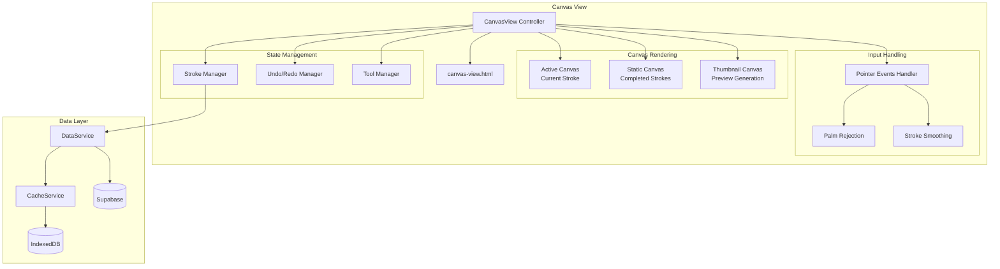

# Design Document: Canvas View

## Overview

The Canvas View feature provides a digital canvas for freehand drawing and handwriting using stylus or M-Pencil input devices. The implementation follows the existing application architecture patterns, using a view controller class with HTML template loading, Supabase backend integration, and IndexedDB caching for offline support.

Key design decisions:
- **Stroke-based storage**: Drawings stored as JSON stroke data (not rasterized images), enabling editing and efficient sync
- **Pointer Events API**: Unified input handling for mouse, touch, and stylus with pressure sensitivity
- **Dual-canvas rendering**: Separate canvases for active stroke and completed strokes for performance
- **Debounced auto-save**: Prevents excessive database writes while ensuring data persistence

## Architecture



## Components and Interfaces

### CanvasView Controller

The main controller class following the existing view pattern:

```javascript
class CanvasView {
    constructor(stateManager) {
        this.stateManager = stateManager;
        this.documents = [];
        this.currentDocument = null;
        this.strokeManager = null;
        this.undoManager = null;
        this.toolManager = null;
        this.isDrawing = false;
        this.activeStroke = null;
    }
    
    async init(container) {
        // Load HTML template
        // Initialize canvas elements
        // Setup event listeners
        // Load document list
    }
}
```

### StrokeManager

Manages stroke collection and rendering:

```javascript
class StrokeManager {
    constructor(staticCanvas, activeCanvas) {
        this.strokes = [];
        this.staticCtx = staticCanvas.getContext('2d');
        this.activeCtx = activeCanvas.getContext('2d');
    }
    
    addStroke(stroke) { /* Add stroke and re-render */ }
    removeStroke(strokeId) { /* Remove stroke by ID */ }
    renderAll() { /* Render all strokes to static canvas */ }
    renderStroke(stroke, ctx) { /* Render single stroke */ }
    getStrokeAtPoint(x, y) { /* Hit testing for eraser */ }
    toJSON() { /* Serialize for storage */ }
    fromJSON(data) { /* Deserialize from storage */ }
}
```

### UndoManager

Manages undo/redo history:

```javascript
class UndoManager {
    constructor(maxHistory = 50) {
        this.undoStack = [];
        this.redoStack = [];
        this.maxHistory = maxHistory;
    }
    
    push(action) { /* Add action to undo stack, clear redo */ }
    undo() { /* Pop from undo, push to redo, return action */ }
    redo() { /* Pop from redo, push to undo, return action */ }
    canUndo() { /* Check if undo available */ }
    canRedo() { /* Check if redo available */ }
    clear() { /* Clear both stacks */ }
}
```

### ToolManager

Manages drawing tool state:

```javascript
class ToolManager {
    constructor() {
        this.currentTool = 'pen';
        this.color = '#000000';
        this.baseWidth = 3;
        this.tools = {
            pen: { opacity: 1.0, widthMultiplier: 1.0 },
            highlighter: { opacity: 0.4, widthMultiplier: 3.0 },
            eraser: { mode: 'stroke' }
        };
    }
    
    setTool(toolName) { /* Switch active tool */ }
    setColor(color) { /* Set stroke color */ }
    setWidth(width) { /* Set base stroke width */ }
    getStrokeStyle() { /* Get current style for new strokes */ }
}
```

### PointerEventHandler

Handles unified pointer input:

```javascript
class PointerEventHandler {
    constructor(canvas, callbacks) {
        this.canvas = canvas;
        this.callbacks = callbacks;
        this.activePointerId = null;
        this.lastStylusTime = 0;
        this.palmRejectionWindow = 100; // ms
    }
    
    handlePointerDown(event) { /* Start stroke or reject palm */ }
    handlePointerMove(event) { /* Continue stroke with smoothing */ }
    handlePointerUp(event) { /* Complete stroke */ }
    isPalmTouch(event) { /* Detect palm based on timing/type */ }
    smoothPoint(point, previousPoints) { /* Apply smoothing algorithm */ }
}
```

## Data Models

### Canvas Document

```typescript
interface CanvasDocument {
    id: string;                    // UUID
    user_id: string;               // User UUID
    title: string;                 // Document title
    stroke_data: StrokeData;       // JSON stroke data
    thumbnail_url: string | null;  // Supabase storage URL
    created_at: string;            // ISO timestamp
    updated_at: string;            // ISO timestamp
}
```

### Stroke Data Format

```typescript
interface StrokeData {
    version: number;               // Schema version for migrations
    strokes: Stroke[];             // Array of strokes
}

interface Stroke {
    id: string;                    // Unique stroke ID
    tool: 'pen' | 'highlighter';   // Tool used
    color: string;                 // Hex color
    baseWidth: number;             // Base width in pixels
    opacity: number;               // 0-1 opacity
    points: Point[];               // Array of points
    createdAt: number;             // Unix timestamp
}

interface Point {
    x: number;                     // X coordinate (0-1 normalized)
    y: number;                     // Y coordinate (0-1 normalized)
    pressure: number;              // Pressure value (0-1)
    timestamp: number;             // Unix timestamp
}
```

### Undo Action

```typescript
interface UndoAction {
    type: 'add' | 'remove' | 'clear';
    strokes: Stroke[];             // Affected strokes
}
```

### Database Schema

```sql
CREATE TABLE IF NOT EXISTS canvas_documents (
    id UUID PRIMARY KEY DEFAULT uuid_generate_v4(),
    user_id UUID REFERENCES auth.users(id) ON DELETE CASCADE NOT NULL,
    title TEXT NOT NULL DEFAULT 'Untitled Canvas',
    stroke_data JSONB NOT NULL DEFAULT '{"version": 1, "strokes": []}',
    thumbnail_url TEXT,
    created_at TIMESTAMP WITH TIME ZONE DEFAULT NOW(),
    updated_at TIMESTAMP WITH TIME ZONE DEFAULT NOW()
);

-- RLS Policies
ALTER TABLE canvas_documents ENABLE ROW LEVEL SECURITY;

CREATE POLICY "Users can view their own canvas documents"
    ON canvas_documents FOR SELECT USING (auth.uid() = user_id);

CREATE POLICY "Users can insert their own canvas documents"
    ON canvas_documents FOR INSERT WITH CHECK (auth.uid() = user_id);

CREATE POLICY "Users can update their own canvas documents"
    ON canvas_documents FOR UPDATE USING (auth.uid() = user_id);

CREATE POLICY "Users can delete their own canvas documents"
    ON canvas_documents FOR DELETE USING (auth.uid() = user_id);

-- Index for performance
CREATE INDEX IF NOT EXISTS idx_canvas_documents_user 
    ON canvas_documents(user_id, updated_at DESC);
```


## Correctness Properties

*A property is a characteristic or behavior that should hold true across all valid executions of a system—essentially, a formal statement about what the system should do. Properties serve as the bridge between human-readable specifications and machine-verifiable correctness guarantees.*

### Property 1: Stroke Data Round-Trip

*For any* valid StrokeData object, serializing to JSON and then deserializing back SHALL produce an equivalent StrokeData object with identical strokes, points, and metadata.

**Validates: Requirements 8.4, 8.5, 8.6**

### Property 2: Document Loading Renders All Strokes

*For any* Canvas_Document with N strokes in its stroke_data, loading that document SHALL result in exactly N strokes being rendered on the canvas, with each stroke's visual properties matching the stored data.

**Validates: Requirements 1.4, 7.5**

### Property 3: Stroke Point Data Validity

*For any* pointer movement captured during drawing, each recorded point SHALL contain: x coordinate in range [0,1], y coordinate in range [0,1], pressure value in range [0,1], and a valid timestamp.

**Validates: Requirements 2.2, 8.2**

### Property 4: Pressure Modulates Stroke Width

*For any* point with pressure value P and base width W, the rendered stroke width at that point SHALL be proportional to P × W, where higher pressure produces wider strokes.

**Validates: Requirements 2.4**

### Property 5: Palm Rejection During Stylus Input

*For any* touch event that occurs within 100ms of an active stylus stroke, the touch input SHALL be ignored and not create a new stroke or affect the current stroke.

**Validates: Requirements 2.5**

### Property 6: Tool Settings Apply to New Strokes

*For any* change to tool type, color, or width settings, all subsequently created strokes SHALL have the new settings applied, while existing strokes remain unchanged.

**Validates: Requirements 3.4, 4.3, 4.4**

### Property 7: Eraser Removes Complete Strokes

*For any* eraser path that intersects with a stroke, the entire stroke SHALL be removed from the stroke collection (not partially erased), and the stroke count SHALL decrease by the number of intersected strokes.

**Validates: Requirements 3.3, 3.5**

### Property 8: Undo-Redo Round-Trip

*For any* stroke that is undone, performing a redo immediately after SHALL restore that exact stroke to the canvas with all original properties intact.

**Validates: Requirements 5.1, 5.2**

### Property 9: New Stroke Clears Redo Stack

*For any* state where the redo stack contains N items (N > 0), drawing a new stroke SHALL result in the redo stack being empty (length = 0).

**Validates: Requirements 5.3**

### Property 10: Undo History Capacity

*For any* sequence of 50 or more stroke additions, the undo stack SHALL contain at least 50 actions, allowing the user to undo at least 50 operations.

**Validates: Requirements 5.4**

### Property 11: Clear Canvas Removes All Strokes

*For any* canvas with N strokes (N > 0), confirming the clear action SHALL result in exactly 0 strokes remaining in the stroke collection.

**Validates: Requirements 6.2**

### Property 12: Export Generates Valid PNG

*For any* canvas with strokes, exporting SHALL produce a valid PNG data URL, and the suggested filename SHALL contain the document title and a timestamp.

**Validates: Requirements 6.3, 6.4**

### Property 13: Stroke Data Structure Validation

*For any* stroke in the stroke collection, it SHALL contain: a unique ID, tool type ('pen' or 'highlighter'), valid hex color, base width (1-20), opacity (0-1), non-empty points array, and creation timestamp.

**Validates: Requirements 8.1, 8.2, 8.3**

### Property 14: Width Constraint Enforcement

*For any* width value set by the user, the actual base width SHALL be clamped to the range [1, 20] pixels.

**Validates: Requirements 4.2**

## Error Handling

### Input Errors

| Error Condition | Handling Strategy |
|----------------|-------------------|
| Invalid pointer event | Log warning, ignore event |
| Pressure data unavailable | Default to pressure = 0.5 |
| Canvas context unavailable | Show error toast, disable drawing |
| Invalid stroke data JSON | Log error, initialize empty stroke collection |

### Storage Errors

| Error Condition | Handling Strategy |
|----------------|-------------------|
| Supabase save failure | Queue for retry, show offline indicator |
| IndexedDB unavailable | Fall back to memory-only (warn user) |
| Thumbnail generation failure | Save document without thumbnail |
| Storage quota exceeded | Prompt user to delete old documents |

### Network Errors

| Error Condition | Handling Strategy |
|----------------|-------------------|
| Offline during save | Cache locally, sync when online |
| Sync conflict | Last-write-wins with timestamp comparison |
| Document load failure | Show cached version if available, else error |

### Recovery Strategies

1. **Auto-save failure**: Retry with exponential backoff (1s, 2s, 4s, max 30s)
2. **Corrupted stroke data**: Attempt partial recovery, log corrupted strokes
3. **Canvas resize**: Re-render all strokes at new resolution
4. **Memory pressure**: Flatten old strokes to static canvas image

## Testing Strategy

### Unit Tests

Unit tests focus on specific examples and edge cases:

- Tool manager state transitions
- Undo manager stack operations (empty stack, full stack, overflow)
- Stroke smoothing algorithm with known input/output pairs
- Point normalization edge cases (canvas boundaries)
- Color validation (valid hex, invalid formats)
- Width clamping at boundaries (0, 1, 20, 21)

### Property-Based Tests

Property tests verify universal properties across generated inputs. Each property test MUST:
- Run minimum 100 iterations
- Reference the design document property number
- Use tag format: **Feature: canvas-view, Property N: [property text]**

**Testing Library**: fast-check (JavaScript property-based testing)

**Generator Requirements**:
- `arbitraryPoint`: Generate points with x, y in [0,1], pressure in [0,1], valid timestamp
- `arbitraryStroke`: Generate strokes with valid tool, color, width, and 1-100 points
- `arbitraryStrokeData`: Generate StrokeData with 0-50 strokes
- `arbitraryCanvasDocument`: Generate documents with metadata and stroke data

**Property Test Implementation Pattern**:

```javascript
import fc from 'fast-check';

// Feature: canvas-view, Property 1: Stroke Data Round-Trip
test('stroke data serialization round-trip', () => {
    fc.assert(
        fc.property(arbitraryStrokeData, (strokeData) => {
            const json = JSON.stringify(strokeData);
            const restored = JSON.parse(json);
            return deepEqual(strokeData, restored);
        }),
        { numRuns: 100 }
    );
});
```

### Integration Tests

- Document CRUD operations with Supabase
- Offline/online sync behavior
- Canvas rendering with actual DOM
- Keyboard shortcut handling
- Export functionality

### Manual Testing Checklist

- [ ] Stylus pressure sensitivity on tablet device
- [ ] Palm rejection while writing
- [ ] Visual smoothness of strokes
- [ ] Theme switching (light/dark)
- [ ] Responsive layout on different screen sizes
- [ ] Performance with 1000+ strokes
