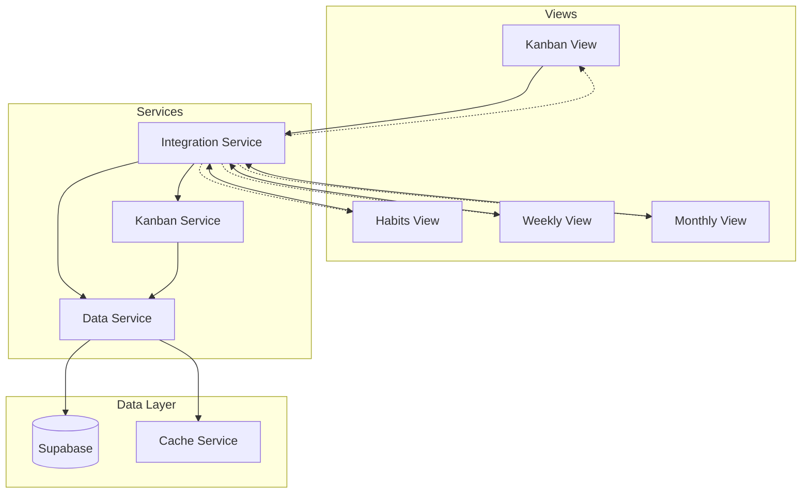

# Design Document: Cross-Feature Integration

## Overview

This design document describes the architecture and implementation approach for integrating various app features together, enabling seamless data flow and navigation between the Kanban board, Calendar, Habits, Weekly View, and Monthly View. The integration creates a unified productivity experience through a centralized Integration Service that coordinates cross-view data sharing, navigation, and synchronization.

## Architecture

The cross-feature integration follows a service-oriented architecture with an Integration Service acting as the central coordinator between existing view controllers and services.



### Key Design Decisions

1. **Centralized Integration Service**: A single service coordinates all cross-feature interactions, preventing tight coupling between views
2. **Event-Based Updates**: Views subscribe to integration events for real-time updates when linked data changes
3. **Lazy Loading**: Card data for calendar/weekly views is fetched on-demand to minimize initial load time
4. **Existing Patterns**: Leverages existing Data Service caching and offline support patterns

## Components and Interfaces

### Integration Service (`js/integration-service.js`)

The central coordinator for cross-feature data sharing and navigation.

```javascript
/**
 * IntegrationService - Coordinates cross-feature data sharing and navigation
 */
class IntegrationService {
    constructor(dataService, kanbanService) {
        this.dataService = dataService;
        this.kanbanService = kanbanService;
        this.eventListeners = new Map();
    }

    // ==================== CALENDAR INTEGRATION ====================
    
    /**
     * Get Kanban cards with due dates in a date range
     * @param {string} startDate - Start date (YYYY-MM-DD)
     * @param {string} endDate - End date (YYYY-MM-DD)
     * @returns {Promise<Array<CardDueDateEvent>>} Cards formatted for calendar display
     */
    async getCardsDueInRange(startDate, endDate) { }
    
    /**
     * Navigate to a specific card in the Kanban view
     * @param {string} cardId - Card ID to navigate to
     * @param {Object} options - Navigation options (openModal, highlightCard)
     * @returns {Promise<void>}
     */
    async navigateToCard(cardId, options = {}) { }
    
    /**
     * Create a card with pre-filled due date from calendar
     * @param {string} dueDate - Due date (YYYY-MM-DD)
     * @param {Object} cardData - Optional card data (title, boardId, columnId)
     * @returns {Promise<Object>} Created card
     */
    async createCardFromCalendar(dueDate, cardData = {}) { }

    // ==================== HABIT INTEGRATION ====================
    
    /**
     * Create a Kanban card linked to a habit
     * @param {string} habitId - Habit ID to link
     * @param {Object} cardData - Card data (boardId, columnId, title override)
     * @returns {Promise<Object>} Created card with habit link
     */
    async createCardFromHabit(habitId, cardData = {}) { }
    
    /**
     * Link an existing card to a habit
     * @param {string} cardId - Card ID
     * @param {string} habitId - Habit ID
     * @returns {Promise<Object>} Updated card
     */
    async linkCardToHabit(cardId, habitId) { }
    
    /**
     * Get cards linked to a specific habit
     * @param {string} habitId - Habit ID
     * @returns {Promise<Array>} Linked cards with status
     */
    async getCardsLinkedToHabit(habitId) { }

    // ==================== WEEKLY VIEW INTEGRATION ====================
    
    /**
     * Get cards due in the current week
     * @param {Date} weekStart - Start of the week
     * @returns {Promise<Array>} Cards due this week
     */
    async getCardsDueThisWeek(weekStart) { }
    
    /**
     * Get unified task list (weekly goals + cards due)
     * @param {number} year - Year
     * @param {number} weekNumber - Week number
     * @returns {Promise<Array<UnifiedTask>>} Combined task list
     */
    async getUnifiedWeeklyTasks(year, weekNumber) { }

    // ==================== MONTHLY VIEW INTEGRATION ====================
    
    /**
     * Get cards due in a specific month
     * @param {number} year - Year
     * @param {number} month - Month (1-12)
     * @returns {Promise<Array>} Cards due this month
     */
    async getCardsDueThisMonth(year, month) { }
    
    /**
     * Get monthly card completion summary
     * @param {number} year - Year
     * @param {number} month - Month (1-12)
     * @returns {Promise<CardCompletionSummary>} Completion statistics
     */
    async getMonthlyCompletionSummary(year, month) { }
    
    /**
     * Link an action plan item to a Kanban card
     * @param {string} actionPlanItemId - Action plan item ID
     * @param {string} cardId - Card ID
     * @returns {Promise<void>}
     */
    async linkActionPlanToCard(actionPlanItemId, cardId) { }

    // ==================== NAVIGATION ====================
    
    /**
     * Navigate to a view with optional target item
     * @param {string} viewName - Target view (kanban, habits, weekly, monthly)
     * @param {Object} params - Navigation parameters
     * @returns {Promise<void>}
     */
    async navigateTo(viewName, params = {}) { }

    // ==================== EVENT SYSTEM ====================
    
    /**
     * Subscribe to integration events
     * @param {string} eventType - Event type (cardUpdated, cardDeleted, habitLinked)
     * @param {Function} callback - Event handler
     * @returns {Function} Unsubscribe function
     */
    on(eventType, callback) { }
    
    /**
     * Emit an integration event
     * @param {string} eventType - Event type
     * @param {Object} data - Event data
     */
    emit(eventType, data) { }
}
```

### Card Due Date Event Interface

```javascript
/**
 * @typedef {Object} CardDueDateEvent
 * @property {string} id - Card ID
 * @property {string} title - Card title
 * @property {string} date - Due date (YYYY-MM-DD)
 * @property {string} boardId - Board ID
 * @property {string} boardTitle - Board title
 * @property {string} columnId - Column ID
 * @property {string} columnTitle - Column title (status)
 * @property {'high'|'medium'|'low'|null} priority - Card priority
 * @property {boolean} isOverdue - Whether the card is overdue
 * @property {boolean} isDueToday - Whether the card is due today
 * @property {'card'} eventType - Event type identifier
 */
```

### Unified Task Interface

```javascript
/**
 * @typedef {Object} UnifiedTask
 * @property {string} id - Task ID
 * @property {string} title - Task title
 * @property {'goal'|'card'} type - Task type
 * @property {boolean} completed - Completion status
 * @property {string|null} dueDate - Due date for cards
 * @property {'high'|'medium'|'low'|null} priority - Priority level
 * @property {Object} source - Source reference (goalId or cardId/boardId)
 */
```

### Card Completion Summary Interface

```javascript
/**
 * @typedef {Object} CardCompletionSummary
 * @property {number} totalCompleted - Total cards completed this month
 * @property {number} totalCreated - Total cards created this month
 * @property {Object} byPriority - Completion by priority {high, medium, low}
 * @property {number} previousMonthCompleted - Previous month's completion count
 * @property {number} completionTrend - Percentage change from previous month
 */
```

### View Integration Points

Each view will be extended with integration hooks:

#### Kanban View Extensions
- Card modal: Add habit linking dropdown
- Card display: Show habit link indicator badge

#### Habits View Extensions
- Habit item: Add "Create Card" button
- Habit detail: Show linked cards section

#### Weekly View Extensions
- New section: "Tasks Due This Week" panel
- Quick-add: Card creation with week date picker

#### Monthly View Extensions
- Calendar: Card due date overlay with toggle
- Summary: Card completion statistics panel
- Action plan: Card linking option

## Data Models

### Database Schema Extensions

#### kanban_cards table (existing - add column)
```sql
-- Add linked_habit_id column to kanban_cards
ALTER TABLE kanban_cards 
ADD COLUMN IF NOT EXISTS linked_habit_id UUID REFERENCES daily_habits(id) ON DELETE SET NULL;

-- Index for habit-card lookups
CREATE INDEX IF NOT EXISTS idx_kanban_cards_linked_habit ON kanban_cards(linked_habit_id) 
WHERE linked_habit_id IS NOT NULL;
```

#### monthly_data table (existing - extend action_plan JSONB)
The action_plan JSONB array items will include an optional `linked_card_id` field:
```javascript
// Action plan item structure
{
  id: "uuid",
  title: "string",
  progress: 0-100,
  linked_card_id: "uuid" | null  // NEW: Link to Kanban card
}
```

### TypeScript Interfaces (for documentation)

```typescript
interface CardDueDateEvent {
  id: string;
  title: string;
  date: string;
  boardId: string;
  boardTitle: string;
  columnId: string;
  columnTitle: string;
  priority: 'high' | 'medium' | 'low' | null;
  isOverdue: boolean;
  isDueToday: boolean;
  eventType: 'card';
}

interface UnifiedTask {
  id: string;
  title: string;
  type: 'goal' | 'card';
  completed: boolean;
  dueDate: string | null;
  priority: 'high' | 'medium' | 'low' | null;
  source: {
    goalId?: string;
    cardId?: string;
    boardId?: string;
  };
}

interface CardCompletionSummary {
  totalCompleted: number;
  totalCreated: number;
  byPriority: {
    high: number;
    medium: number;
    low: number;
  };
  previousMonthCompleted: number;
  completionTrend: number;
}

interface HabitCardLink {
  cardId: string;
  habitId: string;
  cardTitle: string;
  cardStatus: string;
  cardDueDate: string | null;
  isCompleted: boolean;
}

interface ActionPlanCardLink {
  actionPlanItemId: string;
  cardId: string;
  cardTitle: string;
  cardStatus: string;
  isCompleted: boolean;
}
```


## Correctness Properties

*A property is a characteristic or behavior that should hold true across all valid executions of a system—essentially, a formal statement about what the system should do. Properties serve as the bridge between human-readable specifications and machine-verifiable correctness guarantees.*

### Property 1: Date Range Filtering Returns Only Cards Within Range

*For any* date range (startDate, endDate) and any set of Kanban cards with due dates, calling `getCardsDueInRange(startDate, endDate)` SHALL return only cards where `startDate <= due_date <= endDate`.

**Validates: Requirements 1.1, 7.1, 10.1**

### Property 2: Overdue and Today Flags Are Correctly Calculated

*For any* Kanban card with a due_date:
- If `due_date < today`, then `isOverdue` SHALL be `true`
- If `due_date === today`, then `isDueToday` SHALL be `true`
- If `due_date > today`, then both flags SHALL be `false`

**Validates: Requirements 1.4, 1.5, 7.4**

### Property 3: Card Creation Pre-fills Correct Data

*For any* card creation from calendar or habit:
- `createCardFromCalendar(dueDate, data)` SHALL return a card with `due_date === dueDate`
- `createCardFromHabit(habitId, data)` SHALL return a card with `linked_habit_id === habitId` and `title` containing the habit name

**Validates: Requirements 3.1, 4.2, 4.3, 4.4**

### Property 4: Unlinking Preserves Both Items

*For any* card linked to a habit, calling `unlinkCardFromHabit(cardId)` SHALL:
- Set the card's `linked_habit_id` to `null`
- NOT delete the card
- NOT delete the habit

**Validates: Requirements 5.4**

### Property 5: Linked Cards Retrieval Returns Correct Cards With Status

*For any* habit with linked cards, calling `getCardsLinkedToHabit(habitId)` SHALL return all cards where `linked_habit_id === habitId`, and each card SHALL include `isCompleted` reflecting whether the card is in a "Done" column.

**Validates: Requirements 6.1, 6.3**

### Property 6: Card Due Date Events Contain Required Fields

*For any* CardDueDateEvent returned by the Integration Service, the object SHALL contain: `id`, `title`, `date`, `boardId`, `boardTitle`, `columnId`, `columnTitle`, `priority`, `isOverdue`, `isDueToday`, and `eventType`.

**Validates: Requirements 1.3, 6.2, 7.3**

### Property 7: Unified Task List Combines Goals and Cards With Type Distinction

*For any* week, calling `getUnifiedWeeklyTasks(year, weekNumber)` SHALL return an array where:
- Each item has a `type` field that is either `'goal'` or `'card'`
- All weekly goals for that week are included with `type === 'goal'`
- All cards due that week are included with `type === 'card'`
- Cards in "Done" columns have `completed === true`

**Validates: Requirements 8.1, 8.2, 8.4**

### Property 8: Monthly Completion Summary Contains All Required Statistics

*For any* month, calling `getMonthlyCompletionSummary(year, month)` SHALL return an object containing:
- `totalCompleted`: count of cards moved to Done in that month
- `totalCreated`: count of cards created in that month
- `byPriority`: object with `high`, `medium`, `low` completion counts
- `previousMonthCompleted`: previous month's completion count
- `completionTrend`: percentage change from previous month

**Validates: Requirements 12.1, 12.2, 12.4**

### Property 9: Action Plan Card Linking Shows Card Status

*For any* action plan item with a `linked_card_id`, retrieving the action plan SHALL include the linked card's current status (column name) and completion state.

**Validates: Requirements 13.2, 13.4**

### Property 10: Deep Link URL Parsing Extracts Correct IDs

*For any* URL with integration parameters (e.g., `?view=kanban&cardId=xxx` or `?view=habits&habitId=yyy`), the Integration Service SHALL correctly parse and return the view name and item ID.

**Validates: Requirements 14.3**

### Property 11: Data Consistency Round-Trip

*For any* Kanban card update (due_date, title, column), reading the card from any integrated view (calendar, weekly, monthly, habits) SHALL return the updated data.

**Validates: Requirements 15.1, 15.5**

### Property 12: Cascade Behavior on Delete Updates Linked Items

*For any* deleted Kanban card with linked action plan items, the action plan items SHALL have their `linked_card_id` set to `null`.
*For any* deleted habit with linked cards, the cards SHALL have their `linked_habit_id` set to `null` but SHALL NOT be deleted.

**Validates: Requirements 15.2, 15.3**

## Error Handling

### Navigation Errors

| Error Scenario | Handling Strategy |
|----------------|-------------------|
| Card not found during navigation | Display toast: "Card not found. It may have been deleted." Return to source view. |
| Board not found | Display toast: "Board not found." Navigate to Kanban board list. |
| Habit not found | Display toast: "Habit not found." Navigate to Habits view. |
| Network error during navigation | Display toast: "Unable to load. Please check your connection." |

### Data Loading Errors

| Error Scenario | Handling Strategy |
|----------------|-------------------|
| Failed to fetch cards for date range | Return empty array, log error, show subtle indicator |
| Failed to fetch linked cards | Return empty array, show "Unable to load linked cards" message |
| Failed to fetch completion summary | Return default summary with zeros, log error |

### Creation/Update Errors

| Error Scenario | Handling Strategy |
|----------------|-------------------|
| Card creation fails | Display toast: "Failed to create card. Please try again." |
| Linking fails | Display toast: "Failed to link items. Please try again." |
| No boards available for card creation | Display modal prompting user to create a board first |

### Offline Handling

- Use existing cache-first strategy from Data Service
- Queue link/unlink operations for sync when online
- Display offline indicator when operations are queued
- Sync queued operations on reconnection

## Testing Strategy

### Unit Tests

Unit tests will cover specific examples and edge cases:

1. **Date boundary tests**: Cards exactly on startDate and endDate boundaries
2. **Empty state tests**: No cards, no habits, no boards
3. **Null handling**: Cards without due dates, habits without linked cards
4. **Edge cases**: Midnight boundary for today/overdue calculation
5. **Invalid input**: Invalid date formats, non-existent IDs

### Property-Based Tests

Property-based tests will verify universal properties using a PBT library (fast-check for JavaScript):

**Configuration**: Minimum 100 iterations per property test

Each property test will be tagged with:
```javascript
// Feature: cross-feature-integration, Property N: [property description]
```

**Property Test Coverage**:

| Property | Test Description |
|----------|------------------|
| Property 1 | Generate random cards with random due dates, random date ranges, verify filtering |
| Property 2 | Generate random dates relative to today, verify flag calculations |
| Property 3 | Generate random due dates and habit data, verify pre-filled fields |
| Property 4 | Generate linked card-habit pairs, unlink, verify both exist |
| Property 5 | Generate habits with multiple linked cards in various columns, verify retrieval |
| Property 6 | Generate random card data, convert to CardDueDateEvent, verify all fields present |
| Property 7 | Generate random goals and cards for a week, verify unified list properties |
| Property 8 | Generate random card completions over two months, verify summary calculations |
| Property 9 | Generate action plan items with linked cards, verify status inclusion |
| Property 10 | Generate random URL parameters, verify parsing |
| Property 11 | Generate card updates, read from multiple views, verify consistency |
| Property 12 | Generate linked items, delete source, verify cascade behavior |

### Integration Tests

Integration tests will verify cross-view interactions:

1. **Calendar → Kanban navigation**: Click card event, verify correct board/card loads
2. **Habits → Kanban navigation**: Click linked card, verify navigation
3. **Weekly → Kanban navigation**: Click task, verify navigation
4. **Card creation flow**: Create from calendar, verify appears in all views
5. **Linking flow**: Link card to habit, verify appears in habit view
6. **Delete cascade**: Delete card, verify removed from all views

### Test File Structure

```
tests/
├── integration-service.test.js       # Unit tests for Integration Service
├── integration-service.property.js   # Property-based tests
├── integration-navigation.test.js    # Navigation integration tests
└── integration-sync.test.js          # Data sync tests
```
