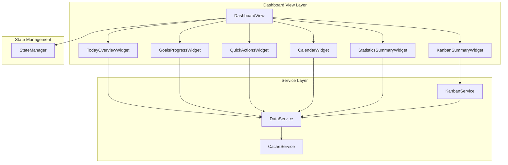

# Design Document: Dashboard Home View

## Overview

The Dashboard Home View serves as the central hub for the Daily Planner application, providing users with a comprehensive overview of their day, goals, tasks, and productivity metrics. It aggregates data from all existing features (habits, goals, calendar, Kanban, Pomodoro) into a single, responsive view with customizable widgets.

The dashboard follows the existing view architecture pattern, implementing a `DashboardView` class that integrates with the `StateManager` and uses `dataService` for data operations. It leverages the existing cache-first strategy for optimal performance and offline support.

## Architecture



## Components and Interfaces


### DashboardView Class

The main view controller that orchestrates widget loading and manages the dashboard layout.

```javascript
class DashboardView {
    constructor(stateManager) {
        this.stateManager = stateManager;
        this.widgets = new Map();
        this.widgetConfig = this.loadWidgetConfig();
    }

    async init(container) {
        this.container = container;
        await this.loadTemplate();
        this.setupEventListeners();
        await this.loadAllWidgets();
    }

    async loadAllWidgets() {
        // Load all widgets in parallel for performance
        const widgetPromises = [
            this.loadTodayOverview(),
            this.loadGoalsProgress(),
            this.loadKanbanSummary(),
            this.loadCalendarWidget(),
            this.loadStatisticsSummary()
        ];
        
        await Promise.allSettled(widgetPromises);
    }

    loadWidgetConfig() {
        // Load from localStorage or return defaults
        const saved = localStorage.getItem('dashboardWidgetConfig');
        return saved ? JSON.parse(saved) : this.getDefaultConfig();
    }

    saveWidgetConfig() {
        localStorage.setItem('dashboardWidgetConfig', JSON.stringify(this.widgetConfig));
    }
}
```

### Widget Interface

All widgets implement a common interface for consistency:

```javascript
interface Widget {
    id: string;
    title: string;
    isLoading: boolean;
    hasError: boolean;
    errorMessage: string | null;
    
    async load(): Promise<void>;
    render(): HTMLElement;
    refresh(): Promise<void>;
    destroy(): void;
}
```

### TodayOverviewWidget

Displays today's habits, time blocks, wellness data, and active Pomodoro status.

```javascript
class TodayOverviewWidget {
    constructor(dataService, stateManager) {
        this.dataService = dataService;
        this.stateManager = stateManager;
        this.habits = [];
        this.completions = [];
        this.timeBlocks = [];
        this.wellnessData = { mood: null, sleep: null, water: null };
    }

    async load() {
        const today = formatDate(new Date());
        
        // Parallel data fetching
        const [habits, completions, timeBlocks, mood, sleep, water] = await Promise.all([
            this.dataService.getDailyHabits(),
            this.dataService.getDailyHabitCompletions(today, today),
            this.dataService.getTimeBlocks(today),
            this.dataService.getMoodEntries(today, today),
            this.dataService.getSleepEntries(today, today),
            this.dataService.getWaterEntries(today, today)
        ]);

        this.habits = habits;
        this.completions = completions;
        this.timeBlocks = timeBlocks;
        this.wellnessData = {
            mood: mood[0] || null,
            sleep: sleep[0] || null,
            water: water[0] || null
        };
    }

    async toggleHabitCompletion(habitId, completed) {
        const today = formatDate(new Date());
        if (completed) {
            await this.dataService.createDailyHabitCompletion({
                habit_id: habitId,
                date: today,
                completed: true
            });
        } else {
            await this.dataService.deleteDailyHabitCompletion(habitId, today);
        }
        await this.load();
    }
}
```


### GoalsProgressWidget

Displays annual goals with progress bars and weekly goals with completion status.

```javascript
class GoalsProgressWidget {
    constructor(dataService) {
        this.dataService = dataService;
        this.annualGoals = [];
        this.weeklyGoals = [];
    }

    async load() {
        const currentYear = new Date().getFullYear();
        const { year, weekNumber } = this.getCurrentWeek();

        const [annualGoals, weeklyGoals] = await Promise.all([
            this.dataService.getAnnualGoals(currentYear),
            this.dataService.getWeeklyGoals(year, weekNumber)
        ]);

        this.annualGoals = annualGoals;
        this.weeklyGoals = weeklyGoals;
    }

    getCurrentWeek() {
        const now = new Date();
        const start = new Date(now.getFullYear(), 0, 1);
        const diff = now - start;
        const oneWeek = 604800000; // milliseconds in a week
        const weekNumber = Math.ceil((diff / oneWeek) + 1);
        return { year: now.getFullYear(), weekNumber };
    }

    async toggleWeeklyGoal(goalId, completed) {
        await this.dataService.updateWeeklyGoal(goalId, { completed });
        await this.load();
    }
}
```

### KanbanSummaryWidget

Displays cards due today/this week, recently completed cards, and board quick access.

```javascript
class KanbanSummaryWidget {
    constructor(kanbanService) {
        this.kanbanService = kanbanService;
        this.cardsDueToday = [];
        this.cardsDueThisWeek = [];
        this.recentlyCompleted = [];
        this.boards = [];
        this.wipStatus = { inProgress: 0, total: 0 };
    }

    async load() {
        const boards = await this.kanbanService.getBoards();
        this.boards = boards;

        const today = formatDate(new Date());
        const weekEnd = this.getWeekEndDate();

        // Aggregate cards from all boards
        let allCards = [];
        for (const board of boards) {
            const fullBoard = await this.kanbanService.getBoard(board.id);
            if (fullBoard?.cards) {
                allCards = allCards.concat(
                    fullBoard.cards.map(c => ({ ...c, boardTitle: board.title }))
                );
            }
        }

        // Filter cards by due date
        this.cardsDueToday = allCards.filter(c => c.due_date === today && !this.isInDoneColumn(c));
        this.cardsDueThisWeek = allCards.filter(c => 
            c.due_date && c.due_date > today && c.due_date <= weekEnd && !this.isInDoneColumn(c)
        );

        // Recently completed (last 7 days)
        const sevenDaysAgo = this.getDateDaysAgo(7);
        this.recentlyCompleted = allCards.filter(c => 
            this.isInDoneColumn(c) && c.updated_at >= sevenDaysAgo
        ).slice(0, 5);

        // WIP status
        this.wipStatus = {
            inProgress: allCards.filter(c => this.isInProgressColumn(c)).length,
            total: allCards.filter(c => !c.is_backlog).length
        };
    }

    isInDoneColumn(card) {
        // Check if card is in a column named "Done" (case-insensitive)
        return card.column_title?.toLowerCase() === 'done';
    }

    isInProgressColumn(card) {
        return card.column_title?.toLowerCase() === 'in progress';
    }
}
```


### QuickActionsWidget

Provides quick action buttons for common tasks.

```javascript
class QuickActionsWidget {
    constructor(stateManager, dataService, kanbanService) {
        this.stateManager = stateManager;
        this.dataService = dataService;
        this.kanbanService = kanbanService;
    }

    startPomodoro() {
        // Trigger Pomodoro start via global pomodoroTimer or state
        if (window.pomodoroTimer) {
            window.pomodoroTimer.startTimer();
        } else {
            // Navigate to Pomodoro view and start
            window.location.hash = '#pomodoro';
        }
    }

    async openHabitLogModal() {
        const habits = await this.dataService.getDailyHabits();
        // Show modal with habit selection
        this.showModal('habit-log-modal', { habits });
    }

    async openNewCardModal() {
        const boards = await this.kanbanService.getBoards();
        // Show modal with board selection and card form
        this.showModal('new-card-modal', { boards });
    }

    openQuickNoteModal() {
        // Show modal with text input for quick note
        this.showModal('quick-note-modal');
    }
}
```

### CalendarWidget

Displays a mini calendar with event and completion highlights.

```javascript
class CalendarWidget {
    constructor(dataService) {
        this.dataService = dataService;
        this.currentMonth = new Date().getMonth();
        this.currentYear = new Date().getFullYear();
        this.eventDays = new Set();
        this.completionDays = new Set();
    }

    async load() {
        const startDate = `${this.currentYear}-${String(this.currentMonth + 1).padStart(2, '0')}-01`;
        const daysInMonth = new Date(this.currentYear, this.currentMonth + 1, 0).getDate();
        const endDate = `${this.currentYear}-${String(this.currentMonth + 1).padStart(2, '0')}-${daysInMonth}`;

        const [timeBlocks, habitCompletions] = await Promise.all([
            this.dataService.getTimeBlocksRange(startDate, endDate),
            this.dataService.getDailyHabitCompletions(startDate, endDate)
        ]);

        // Mark days with events
        this.eventDays = new Set(timeBlocks.map(tb => tb.date));

        // Mark days with habit completions
        const completionsByDate = {};
        habitCompletions.forEach(c => {
            if (c.completed) {
                completionsByDate[c.date] = (completionsByDate[c.date] || 0) + 1;
            }
        });
        this.completionDays = new Set(Object.keys(completionsByDate));
    }

    navigateMonth(delta) {
        this.currentMonth += delta;
        if (this.currentMonth > 11) {
            this.currentMonth = 0;
            this.currentYear++;
        } else if (this.currentMonth < 0) {
            this.currentMonth = 11;
            this.currentYear--;
        }
        this.load();
    }

    onDayClick(date) {
        // Navigate to monthly view for that date
        window.location.hash = `#monthly/${date}`;
    }
}
```


### StatisticsSummaryWidget

Displays key productivity metrics and trends.

```javascript
class StatisticsSummaryWidget {
    constructor(dataService, kanbanService) {
        this.dataService = dataService;
        this.kanbanService = kanbanService;
        this.stats = {
            habitStreak: 0,
            pomodoroThisWeek: 0,
            cardsCompletedThisWeek: 0,
            readingProgress: { completed: 0, total: 0 }
        };
        this.previousStats = null;
    }

    async load() {
        const today = new Date();
        const weekStart = this.getWeekStart(today);
        const weekStartStr = formatDate(weekStart);
        const todayStr = formatDate(today);

        const [pomodoroSessions, readingList] = await Promise.all([
            this.dataService.getPomodoroSessionsRange(weekStartStr, todayStr),
            this.dataService.getReadingList(today.getFullYear())
        ]);

        // Calculate habit streak
        this.stats.habitStreak = await this.calculateHabitStreak();

        // Pomodoro sessions this week
        this.stats.pomodoroThisWeek = pomodoroSessions
            .filter(s => s.session_type === 'focus' && s.was_completed).length;

        // Cards completed this week
        this.stats.cardsCompletedThisWeek = await this.getCardsCompletedThisWeek(weekStartStr);

        // Reading progress
        this.stats.readingProgress = {
            completed: readingList.filter(b => b.completed).length,
            total: readingList.length
        };
    }

    async calculateHabitStreak() {
        const habits = await this.dataService.getDailyHabits();
        if (habits.length === 0) return 0;

        let streak = 0;
        let checkDate = new Date();

        while (true) {
            const dateStr = formatDate(checkDate);
            const completions = await this.dataService.getDailyHabitCompletions(dateStr, dateStr);
            const completedCount = completions.filter(c => c.completed).length;

            if (completedCount === habits.length) {
                streak++;
                checkDate.setDate(checkDate.getDate() - 1);
            } else if (streak === 0) {
                // Allow today to be incomplete
                checkDate.setDate(checkDate.getDate() - 1);
            } else {
                break;
            }

            if (streak > 365) break; // Safety limit
        }

        return streak;
    }

    getWeekStart(date) {
        const d = new Date(date);
        const day = d.getDay();
        const diff = day === 0 ? -6 : 1 - day;
        d.setDate(d.getDate() + diff);
        return d;
    }
}
```

## Data Models

### Widget Configuration

```typescript
interface WidgetConfig {
    id: string;
    visible: boolean;
    order: number;
    collapsed?: boolean;
}

interface DashboardConfig {
    widgets: WidgetConfig[];
    lastRefresh: string; // ISO date string
}
```

### Dashboard Data Aggregation

```typescript
interface DashboardData {
    todayOverview: {
        habits: DailyHabit[];
        completions: HabitCompletion[];
        timeBlocks: TimeBlock[];
        wellness: {
            mood: MoodEntry | null;
            sleep: SleepEntry | null;
            water: WaterEntry | null;
        };
        activePomodoroSession: PomodoroSession | null;
    };
    goalsProgress: {
        annualGoals: AnnualGoal[];
        weeklyGoals: WeeklyGoal[];
    };
    kanbanSummary: {
        cardsDueToday: KanbanCard[];
        cardsDueThisWeek: KanbanCard[];
        recentlyCompleted: KanbanCard[];
        boards: KanbanBoard[];
        wipStatus: { inProgress: number; total: number };
    };
    statistics: {
        habitStreak: number;
        pomodoroThisWeek: number;
        cardsCompletedThisWeek: number;
        readingProgress: { completed: number; total: number };
    };
    calendar: {
        eventDays: Set<string>;
        completionDays: Set<string>;
    };
}
```


## Correctness Properties

*A property is a characteristic or behavior that should hold true across all valid executions of a system—essentially, a formal statement about what the system should do. Properties serve as the bridge between human-readable specifications and machine-verifiable correctness guarantees.*

Based on the prework analysis, the following properties have been identified for testing:

### Property 1: Widget Error Isolation

*For any* dashboard with multiple widgets, if one widget's data loading fails, all other widgets SHALL still render successfully with their data.

**Validates: Requirements 1.5, 12.1**

### Property 2: Data Completeness - All Items Displayed

*For any* set of daily habits, annual goals, or weekly goals returned by the data service, the corresponding widget SHALL include all items in its rendered output.

**Validates: Requirements 2.1, 3.1, 3.3**

### Property 3: Time Blocks Sorted by Start Time

*For any* set of time blocks for today, the Today Overview widget SHALL display them in ascending order by start_time.

**Validates: Requirements 2.4**

### Property 4: Rendered Output Contains Required Fields

*For any* time block displayed, the output SHALL contain the activity name, time range, and category color. *For any* annual goal displayed, the output SHALL contain the title, progress percentage, and category color. *For any* Kanban card displayed, the output SHALL contain the card title, board name, and priority indicator.

**Validates: Requirements 2.5, 3.2, 4.3**

### Property 5: Habit Toggle State Synchronization

*For any* habit completion toggle action, the data service SHALL be called with the correct habit ID and completion state, and the widget SHALL reflect the updated state after reload.

**Validates: Requirements 2.3, 3.5**

### Property 6: Wellness Data Conditional Display

*For any* wellness data (mood, sleep, water) that exists for today, the Today Overview widget SHALL display that data. *For any* wellness data type that does not exist for today, the widget SHALL display a prompt to add an entry.

**Validates: Requirements 2.6, 2.7**

### Property 7: Active Pomodoro Session Display

*For any* active Pomodoro session in the state manager, the Today Overview widget SHALL display the session status including mode and time remaining.

**Validates: Requirements 2.8**

### Property 8: Kanban Cards Due Date Filtering

*For any* set of Kanban cards across all boards, the Kanban Summary widget SHALL correctly filter cards into: (a) cards due today, (b) cards due this week but not today, and (c) cards completed in the last 7 days. Cards in "Done" columns SHALL be excluded from due today/this week lists.

**Validates: Requirements 4.1, 4.2, 4.4**

### Property 9: WIP Status Aggregation

*For any* set of Kanban cards across all boards, the WIP status SHALL correctly count cards that are in "In Progress" columns and the total non-backlog cards.

**Validates: Requirements 4.7**

### Property 10: Calendar Month Navigation Round-Trip

*For any* starting month, navigating forward N months then backward N months SHALL return to the original month and year.

**Validates: Requirements 6.6**

### Property 11: Calendar Day Highlighting

*For any* day in the current month, if that day has time blocks or Kanban cards with due dates, the calendar widget SHALL mark that day as having events. If that day has habit completions, the calendar widget SHALL mark that day as having completions.

**Validates: Requirements 6.2, 6.3**

### Property 12: Habit Streak Calculation

*For any* sequence of daily habit completions, the streak count SHALL equal the number of consecutive days (ending today or yesterday) where all habits were completed.

**Validates: Requirements 7.1**

### Property 13: Statistics Counting

*For any* set of Pomodoro sessions in the current week, the statistics widget SHALL count only completed focus sessions. *For any* set of Kanban cards, the statistics widget SHALL count only cards moved to "Done" columns within the current week.

**Validates: Requirements 7.2, 7.3**

### Property 14: Reading Progress Calculation

*For any* reading list for the current year, the reading progress SHALL show the count of completed books and total books.

**Validates: Requirements 7.4**

### Property 15: Widget Configuration Persistence Round-Trip

*For any* valid widget configuration (visibility and order settings), saving to localStorage then loading SHALL produce an equivalent configuration object.

**Validates: Requirements 10.2**


## Error Handling

### Widget-Level Error Handling

Each widget implements isolated error handling to prevent cascade failures:

```javascript
class BaseWidget {
    constructor() {
        this.isLoading = false;
        this.hasError = false;
        this.errorMessage = null;
    }

    async safeLoad() {
        this.isLoading = true;
        this.hasError = false;
        this.errorMessage = null;

        try {
            await this.load();
        } catch (error) {
            console.error(`Widget ${this.id} failed to load:`, error);
            this.hasError = true;
            this.errorMessage = error.message || 'Failed to load data';
        } finally {
            this.isLoading = false;
        }
    }

    renderError() {
        return `
            <div class="widget-error" role="alert">
                <span class="error-icon">⚠️</span>
                <p>${this.errorMessage}</p>
                <button class="btn-retry" onclick="this.retry()">Retry</button>
            </div>
        `;
    }
}
```

### Dashboard-Level Error Handling

```javascript
class DashboardView {
    async loadAllWidgets() {
        const results = await Promise.allSettled([
            this.widgets.get('todayOverview').safeLoad(),
            this.widgets.get('goalsProgress').safeLoad(),
            this.widgets.get('kanbanSummary').safeLoad(),
            this.widgets.get('calendar').safeLoad(),
            this.widgets.get('statistics').safeLoad()
        ]);

        // Check if all widgets failed
        const allFailed = results.every(r => r.status === 'rejected');
        if (allFailed) {
            this.showFullPageError();
        }
    }

    showFullPageError() {
        this.container.innerHTML = `
            <div class="dashboard-error" role="alert">
                <h2>Unable to Load Dashboard</h2>
                <p>We couldn't load your dashboard data. Please check your connection and try again.</p>
                <button class="btn-primary" onclick="location.reload()">Retry</button>
            </div>
        `;
    }
}
```

### Action Error Handling

```javascript
async toggleHabitCompletion(habitId, completed) {
    const previousState = this.getHabitState(habitId);
    
    // Optimistic update
    this.setHabitState(habitId, completed);
    this.render();

    try {
        await this.dataService.updateHabitCompletion(habitId, completed);
    } catch (error) {
        // Revert on failure
        this.setHabitState(habitId, previousState);
        this.render();
        
        // Show error toast
        if (window.showToast) {
            window.showToast('Failed to update habit. Please try again.', 'error');
        }
    }
}
```

## Testing Strategy

### Unit Tests

Unit tests focus on specific examples and edge cases:

1. **Widget Initialization**: Test that each widget initializes with correct default state
2. **Empty State Handling**: Test widgets display appropriate UI when no data exists
3. **Error State Rendering**: Test error UI renders correctly when widget fails
4. **Navigation Actions**: Test clicking elements triggers correct navigation
5. **Modal Interactions**: Test quick action buttons open correct modals

### Property-Based Tests

Property-based tests validate universal properties using fast-check library:

```javascript
import fc from 'fast-check';

// Feature: dashboard-home, Property 3: Time Blocks Sorted by Start Time
describe('TodayOverviewWidget', () => {
    it('should display time blocks sorted by start time', () => {
        fc.assert(
            fc.property(
                fc.array(fc.record({
                    id: fc.uuid(),
                    date: fc.constant('2024-01-15'),
                    start_time: fc.stringMatching(/^([01]\d|2[0-3]):[0-5]\d$/),
                    end_time: fc.stringMatching(/^([01]\d|2[0-3]):[0-5]\d$/),
                    activity: fc.string({ minLength: 1 }),
                    category: fc.string()
                })),
                (timeBlocks) => {
                    const widget = new TodayOverviewWidget(mockDataService, mockStateManager);
                    widget.timeBlocks = timeBlocks;
                    const rendered = widget.getRenderedTimeBlocks();
                    
                    for (let i = 1; i < rendered.length; i++) {
                        expect(rendered[i].start_time >= rendered[i-1].start_time).toBe(true);
                    }
                }
            ),
            { numRuns: 100 }
        );
    });
});

// Feature: dashboard-home, Property 10: Calendar Month Navigation Round-Trip
describe('CalendarWidget', () => {
    it('should return to original month after forward-backward navigation', () => {
        fc.assert(
            fc.property(
                fc.integer({ min: 0, max: 11 }), // starting month
                fc.integer({ min: 2020, max: 2030 }), // starting year
                fc.integer({ min: 1, max: 24 }), // navigation steps
                (startMonth, startYear, steps) => {
                    const widget = new CalendarWidget(mockDataService);
                    widget.currentMonth = startMonth;
                    widget.currentYear = startYear;
                    
                    // Navigate forward
                    for (let i = 0; i < steps; i++) {
                        widget.navigateMonth(1);
                    }
                    
                    // Navigate backward
                    for (let i = 0; i < steps; i++) {
                        widget.navigateMonth(-1);
                    }
                    
                    expect(widget.currentMonth).toBe(startMonth);
                    expect(widget.currentYear).toBe(startYear);
                }
            ),
            { numRuns: 100 }
        );
    });
});

// Feature: dashboard-home, Property 15: Widget Configuration Persistence Round-Trip
describe('DashboardView', () => {
    it('should preserve widget config after save and load', () => {
        fc.assert(
            fc.property(
                fc.array(fc.record({
                    id: fc.constantFrom('todayOverview', 'goalsProgress', 'kanbanSummary', 'calendar', 'statistics'),
                    visible: fc.boolean(),
                    order: fc.integer({ min: 0, max: 10 }),
                    collapsed: fc.boolean()
                }), { minLength: 1, maxLength: 5 }),
                (widgetConfigs) => {
                    const dashboard = new DashboardView(mockStateManager);
                    dashboard.widgetConfig = { widgets: widgetConfigs };
                    
                    dashboard.saveWidgetConfig();
                    const loaded = dashboard.loadWidgetConfig();
                    
                    expect(loaded).toEqual({ widgets: widgetConfigs });
                }
            ),
            { numRuns: 100 }
        );
    });
});
```

### Test Configuration

- Property-based tests: Minimum 100 iterations per test
- Test framework: Jest with fast-check for property-based testing
- Each property test references its design document property number
- Tag format: `Feature: dashboard-home, Property N: [property description]`
