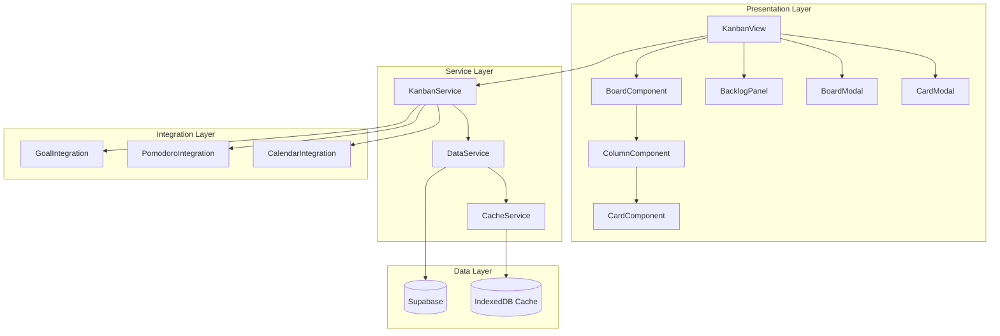
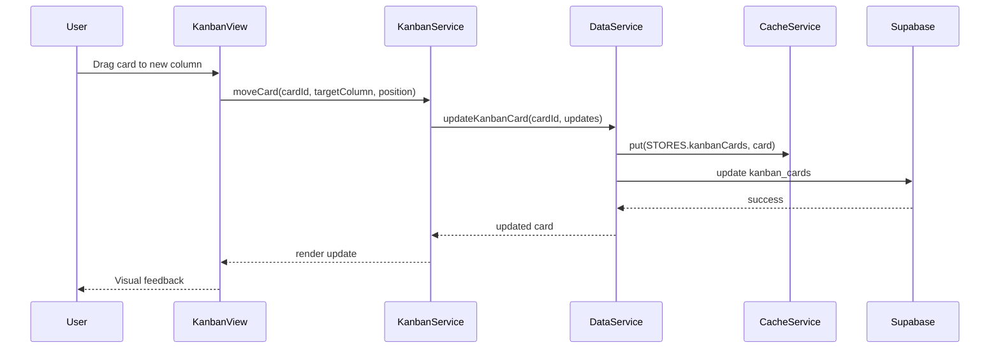

# Design Document: Kanban Board

## Overview

The Kanban Board feature provides a visual task management system integrated into the existing productivity app. It follows the established architectural patterns using vanilla JavaScript for the web version, Supabase for data persistence, and the existing component library (modal, toast, spinner) for UI consistency.

The design prioritizes:
- Seamless integration with existing features (Goals, Pomodoro, Calendar, Categories)
- Offline-first capability using the existing cache service
- Responsive design supporting both desktop and mobile
- Accessibility compliance with keyboard navigation

## Architecture



### Data Flow



## Components and Interfaces

### KanbanView (views/kanban-view.js)

Main view controller following the existing view pattern.

```javascript
class KanbanView {
    constructor(stateManager) {
        this.stateManager = stateManager;
        this.currentBoardId = null;
        this.boards = [];
        this.dragState = null;
    }
    
    async init(container) { }
    async loadBoards() { }
    async loadBoard(boardId) { }
    async createBoard(boardData) { }
    async deleteBoard(boardId) { }
    
    // Drag and drop
    handleDragStart(event, cardId) { }
    handleDragOver(event, columnId) { }
    handleDrop(event, columnId, position) { }
    
    // Rendering
    render() { }
    renderBoardSelector() { }
    renderColumns() { }
    renderBacklog() { }
    
    destroy() { }
}
```

### KanbanService (js/kanban-service.js)

Service layer handling business logic and integrations.

```javascript
class KanbanService {
    // Board operations
    async getBoards() { }
    async getBoard(boardId) { }
    async createBoard(data) { }
    async updateBoard(boardId, updates) { }
    async deleteBoard(boardId) { }
    async createBoardFromTemplate(templateId) { }
    
    // Column operations
    async createColumn(boardId, data) { }
    async updateColumn(columnId, updates) { }
    async deleteColumn(columnId, moveCardsTo) { }
    async reorderColumns(boardId, columnOrder) { }
    
    // Card operations
    async createCard(columnId, data) { }
    async updateCard(cardId, updates) { }
    async deleteCard(cardId) { }
    async moveCard(cardId, targetColumnId, position) { }
    async moveCardToBacklog(cardId) { }
    async moveCardFromBacklog(cardId, columnId, position) { }
    
    // Backlog operations
    async getBacklog(boardId) { }
    async reorderBacklog(boardId, cardOrder) { }
    
    // Integration methods
    async linkCardToGoal(cardId, goalId) { }
    async startPomodoroForCard(cardId) { }
    async getCardPomodoroStats(cardId) { }
    
    // Filtering
    filterCards(cards, filters) { }
    searchCards(cards, query) { }
}
```

### Card Modal Component

Reuses the existing Modal component pattern for card editing.

```javascript
function openCardModal(card, options) {
    const modal = new Modal();
    modal.show({
        title: card ? 'Edit Card' : 'New Card',
        content: renderCardForm(card, options),
        buttons: [
            { text: 'Cancel', action: 'cancel' },
            { text: 'Save', action: 'save', primary: true }
        ]
    });
}

function renderCardForm(card, options) {
    // Returns HTML form with:
    // - Title input
    // - Description textarea
    // - Due date picker
    // - Priority selector
    // - Labels multi-select
    // - Goal link selector
    // - Pomodoro stats display
}
```

### Drag and Drop Handler

```javascript
class DragDropHandler {
    constructor(kanbanView) {
        this.view = kanbanView;
        this.draggedCard = null;
        this.draggedColumn = null;
        this.placeholder = null;
    }
    
    initDragListeners(container) { }
    
    onDragStart(event, type, id) { }
    onDragOver(event) { }
    onDragEnter(event, targetType, targetId) { }
    onDragLeave(event) { }
    onDrop(event, targetType, targetId) { }
    onDragEnd(event) { }
    
    createPlaceholder() { }
    removePlaceholder() { }
    calculateDropPosition(event, container) { }
    
    // Touch support for mobile
    initTouchListeners(container) { }
    onTouchStart(event) { }
    onTouchMove(event) { }
    onTouchEnd(event) { }
}
```

## Data Models

### Database Schema

```sql
-- Kanban Boards Table
CREATE TABLE IF NOT EXISTS kanban_boards (
    id UUID PRIMARY KEY DEFAULT uuid_generate_v4(),
    user_id UUID REFERENCES auth.users(id) ON DELETE CASCADE NOT NULL,
    title TEXT NOT NULL,
    description TEXT,
    category_id UUID REFERENCES custom_categories(id) ON DELETE SET NULL,
    settings JSONB DEFAULT '{}',
    created_at TIMESTAMP WITH TIME ZONE DEFAULT NOW(),
    updated_at TIMESTAMP WITH TIME ZONE DEFAULT NOW()
);

-- Kanban Columns Table
CREATE TABLE IF NOT EXISTS kanban_columns (
    id UUID PRIMARY KEY DEFAULT uuid_generate_v4(),
    board_id UUID REFERENCES kanban_boards(id) ON DELETE CASCADE NOT NULL,
    title TEXT NOT NULL,
    order_index INTEGER NOT NULL DEFAULT 0,
    wip_limit INTEGER,
    color TEXT,
    created_at TIMESTAMP WITH TIME ZONE DEFAULT NOW(),
    updated_at TIMESTAMP WITH TIME ZONE DEFAULT NOW()
);

-- Kanban Cards Table
CREATE TABLE IF NOT EXISTS kanban_cards (
    id UUID PRIMARY KEY DEFAULT uuid_generate_v4(),
    board_id UUID REFERENCES kanban_boards(id) ON DELETE CASCADE NOT NULL,
    column_id UUID REFERENCES kanban_columns(id) ON DELETE SET NULL,
    title TEXT NOT NULL,
    description TEXT,
    order_index INTEGER NOT NULL DEFAULT 0,
    priority TEXT CHECK (priority IN ('high', 'medium', 'low')),
    due_date DATE,
    labels JSONB DEFAULT '[]',
    is_backlog BOOLEAN DEFAULT FALSE,
    linked_goal_id UUID REFERENCES annual_goals(id) ON DELETE SET NULL,
    pomodoro_count INTEGER DEFAULT 0,
    created_at TIMESTAMP WITH TIME ZONE DEFAULT NOW(),
    updated_at TIMESTAMP WITH TIME ZONE DEFAULT NOW()
);

-- Indexes
CREATE INDEX idx_kanban_boards_user ON kanban_boards(user_id);
CREATE INDEX idx_kanban_columns_board ON kanban_columns(board_id);
CREATE INDEX idx_kanban_cards_board ON kanban_cards(board_id);
CREATE INDEX idx_kanban_cards_column ON kanban_cards(column_id);
CREATE INDEX idx_kanban_cards_backlog ON kanban_cards(board_id, is_backlog) WHERE is_backlog = TRUE;
CREATE INDEX idx_kanban_cards_due_date ON kanban_cards(due_date) WHERE due_date IS NOT NULL;
```

### JavaScript Data Structures

```javascript
/**
 * Board object structure
 * @typedef {Object} KanbanBoard
 * @property {string} id - UUID
 * @property {string} user_id - Owner's UUID
 * @property {string} title - Board title
 * @property {string} [description] - Optional description
 * @property {string} [category_id] - Optional category reference
 * @property {Object} settings - Board settings
 * @property {string} created_at - ISO timestamp
 * @property {string} updated_at - ISO timestamp
 */

/**
 * Card object structure
 * @typedef {Object} KanbanCard
 * @property {string} id - UUID
 * @property {string} board_id - Parent board UUID
 * @property {string} [column_id] - Column UUID (null if in backlog)
 * @property {string} title - Card title
 * @property {string} [description] - Optional description
 * @property {number} order_index - Position in column/backlog
 * @property {'high'|'medium'|'low'} [priority] - Priority level
 * @property {string} [due_date] - Due date (YYYY-MM-DD)
 * @property {Array<{name: string, color: string}>} labels - Card labels
 * @property {boolean} is_backlog - True if in backlog
 * @property {string} [linked_goal_id] - Linked annual goal UUID
 * @property {number} pomodoro_count - Completed pomodoro sessions
 */

/**
 * Filter options for cards
 * @typedef {Object} CardFilters
 * @property {string} [search] - Search query
 * @property {'high'|'medium'|'low'} [priority] - Priority filter
 * @property {string[]} [labels] - Label names to filter by
 * @property {'overdue'|'today'|'week'|'none'} [dueDate] - Due date filter
 */
```

### Backlog Panel Design

The backlog is integrated into the Kanban view as a collapsible side panel:

```
┌─────────────────────────────────────────────────────────────────┐
│  Board Title                              [Filter] [+ Add Card] │
├──────────┬──────────────────────────────────────────────────────┤
│ BACKLOG  │  To Do        │  In Progress   │  Done              │
│ (12)     │               │                │                    │
│ ──────── │  ┌─────────┐  │  ┌─────────┐   │  ┌─────────┐       │
│ ┌──────┐ │  │ Card 1  │  │  │ Card 3  │   │  │ Card 5  │       │
│ │Task A│ │  └─────────┘  │  └─────────┘   │  └─────────┘       │
│ └──────┘ │  ┌─────────┐  │  ┌─────────┐   │                    │
│ ┌──────┐ │  │ Card 2  │  │  │ Card 4  │   │                    │
│ │Task B│ │  └─────────┘  │  └─────────┘   │                    │
│ └──────┘ │               │                │                    │
│   ...    │               │                │                    │
│ [<] Hide │               │                │                    │
└──────────┴──────────────────────────────────────────────────────┘
```

- Backlog panel is on the left side, collapsible via toggle button
- Cards can be dragged from backlog to any column
- Cards can be dragged from columns back to backlog
- Backlog shows item count in header
- Backlog state (expanded/collapsed) is persisted in localStorage

### Board Templates

```javascript
const BOARD_TEMPLATES = {
    blank: {
        title: 'Blank Board',
        columns: [
            { title: 'To Do', order_index: 0 },
            { title: 'In Progress', order_index: 1 },
            { title: 'Done', order_index: 2 }
        ],
        cards: []
    },
    personal: {
        title: 'Personal Tasks',
        columns: [
            { title: 'Backlog', order_index: 0 },
            { title: 'This Week', order_index: 1 },
            { title: 'Today', order_index: 2 },
            { title: 'Done', order_index: 3 }
        ],
        cards: []
    },
    project: {
        title: 'Project Management',
        columns: [
            { title: 'Backlog', order_index: 0 },
            { title: 'To Do', order_index: 1 },
            { title: 'In Progress', order_index: 2, wip_limit: 3 },
            { title: 'Review', order_index: 3, wip_limit: 2 },
            { title: 'Done', order_index: 4 }
        ],
        cards: []
    },
    weekly: {
        title: 'Weekly Planning',
        columns: [
            { title: 'Monday', order_index: 0 },
            { title: 'Tuesday', order_index: 1 },
            { title: 'Wednesday', order_index: 2 },
            { title: 'Thursday', order_index: 3 },
            { title: 'Friday', order_index: 4 },
            { title: 'Weekend', order_index: 5 },
            { title: 'Done', order_index: 6 }
        ],
        cards: []
    }
};
```


## Correctness Properties

*A property is a characteristic or behavior that should hold true across all valid executions of a system—essentially, a formal statement about what the system should do. Properties serve as the bridge between human-readable specifications and machine-verifiable correctness guarantees.*

### Property 1: Board Creation Completeness

*For any* valid board creation request with title and optional description/category, the created board SHALL contain a unique ID, the provided title, description, category_id, and valid timestamps.

**Validates: Requirements 1.1**

### Property 2: Board List Sorting

*For any* collection of boards belonging to a user, the board list SHALL be returned sorted by `updated_at` in descending order (most recently modified first).

**Validates: Requirements 1.2**

### Property 3: Entity Update Persistence

*For any* board, column, or card entity, updating a field and then fetching the entity SHALL return the updated value.

**Validates: Requirements 1.3, 2.3**

### Property 4: Cascade Deletion

*For any* board with associated columns and cards, deleting the board SHALL result in zero columns and zero cards referencing that board ID.

**Validates: Requirements 1.4**

### Property 5: Default Columns on Board Creation

*For any* newly created board (using blank template), the board SHALL have exactly three columns with titles "To Do", "In Progress", and "Done" with order indices 0, 1, and 2 respectively.

**Validates: Requirements 2.1**

### Property 6: Column Order Index Consistency

*For any* board after column reordering, the column order indices SHALL be sequential integers starting from 0 with no gaps or duplicates.

**Validates: Requirements 2.2, 2.4**

### Property 7: WIP Limit Non-Blocking

*For any* column with a WIP limit, adding a card that exceeds the limit SHALL succeed (card is added), though the column should be flagged as over-limit.

**Validates: Requirements 2.7**

### Property 8: Card Creation Completeness

*For any* valid card creation request, the created card SHALL contain a unique ID, the provided title, the target column_id, order_index, and valid timestamps.

**Validates: Requirements 3.1**

### Property 9: Card Movement Index Consistency

*For any* card movement (between columns or within a column), all cards in affected columns SHALL have sequential order indices starting from 0 with no gaps or duplicates.

**Validates: Requirements 3.2, 3.3**

### Property 10: Card Deletion

*For any* card, after deletion, querying for that card ID SHALL return null/not found.

**Validates: Requirements 3.5**

### Property 11: Goal-Linked Card Count

*For any* goal with linked cards, the count of cards linked to that goal SHALL equal the actual number of cards with `linked_goal_id` matching the goal ID.

**Validates: Requirements 4.3**

### Property 12: Pomodoro Count Increment

*For any* card, after a Pomodoro session is completed for that card, the card's `pomodoro_count` SHALL be incremented by exactly 1.

**Validates: Requirements 5.3**

### Property 13: Calendar Due Date Availability

*For any* card with a non-null due_date, the card SHALL be included in calendar queries for that date range.

**Validates: Requirements 6.1, 6.3**

### Property 14: Search Filter Accuracy

*For any* search query string, the filtered results SHALL contain only cards where the title OR description contains the query string (case-insensitive).

**Validates: Requirements 7.1**

### Property 15: Priority Filter Accuracy

*For any* priority filter value, the filtered results SHALL contain only cards with exactly that priority value.

**Validates: Requirements 7.2**

### Property 16: Label Filter Accuracy

*For any* label filter value, the filtered results SHALL contain only cards that have that label in their labels array.

**Validates: Requirements 7.3**

### Property 17: Due Date Filter Accuracy

*For any* due date filter (overdue, today, week), the filtered results SHALL contain only cards whose due_date falls within the specified criteria relative to the current date.

**Validates: Requirements 7.4**

### Property 18: Conflict Resolution by Timestamp

*For any* sync conflict between two versions of the same entity, the version with the more recent `updated_at` timestamp SHALL be preserved.

**Validates: Requirements 8.3**

### Property 19: Serialization Round-Trip

*For any* valid board data object (including nested columns and cards), serializing to JSON and then deserializing SHALL produce an object equivalent to the original.

**Validates: Requirements 8.4, 8.5**

### Property 20: Template Instantiation

*For any* template selection, the created board SHALL have columns matching the template's column definitions (titles and order indices).

**Validates: Requirements 10.2**

### Property 21: Backlog Flag Management

*For any* card, moving it to the backlog SHALL set `is_backlog=true` and `column_id=null`, and moving it from backlog to a column SHALL set `is_backlog=false` and `column_id` to the target column.

**Validates: Requirements 11.2, 11.3, 11.4**

### Property 22: Backlog Order Index Consistency

*For any* board's backlog after reordering, the backlog cards' order indices SHALL be sequential integers starting from 0 with no gaps or duplicates.

**Validates: Requirements 11.5**

### Property 23: Last Viewed Board Persistence

*For any* board view, the board ID SHALL be stored, and on subsequent view initialization, the same board ID SHALL be retrieved and loaded.

**Validates: Requirements 12.2, 12.4**

## Error Handling

### Network Errors

```javascript
async function handleNetworkError(operation, error) {
    if (!navigator.onLine) {
        // Queue for offline sync
        await cacheService.addPendingSync({
            type: operation.type,
            store: operation.store,
            data: operation.data
        });
        Toast.warning('You are offline. Changes will sync when connected.');
        return { queued: true };
    }
    
    // Log and show user-friendly message
    console.error(`Kanban ${operation.type} failed:`, error);
    Toast.error(`Failed to ${operation.type}. Please try again.`);
    throw error;
}
```

### Validation Errors

```javascript
function validateBoard(board) {
    const errors = [];
    if (!board.title?.trim()) {
        errors.push('Board title is required');
    }
    if (board.title?.length > 100) {
        errors.push('Board title must be 100 characters or less');
    }
    return errors;
}

function validateCard(card) {
    const errors = [];
    if (!card.title?.trim()) {
        errors.push('Card title is required');
    }
    if (card.title?.length > 200) {
        errors.push('Card title must be 200 characters or less');
    }
    if (card.due_date && isNaN(Date.parse(card.due_date))) {
        errors.push('Invalid due date format');
    }
    if (card.priority && !['high', 'medium', 'low'].includes(card.priority)) {
        errors.push('Invalid priority value');
    }
    return errors;
}
```

### Drag-and-Drop Error Recovery

```javascript
async function handleDropError(dragState, error) {
    console.error('Drop operation failed:', error);
    
    // Revert UI to original state
    await this.loadBoard(this.currentBoardId);
    
    Toast.error('Failed to move item. Please try again.');
}
```

### Conflict Resolution

```javascript
async function resolveConflict(localItem, serverItem) {
    // Prefer most recent modification
    const localTime = new Date(localItem.updated_at).getTime();
    const serverTime = new Date(serverItem.updated_at).getTime();
    
    if (localTime > serverTime) {
        // Push local changes to server
        return await this.forceUpdate(localItem);
    } else {
        // Accept server version
        return serverItem;
    }
}
```

## Testing Strategy

### Unit Tests

Unit tests focus on specific examples, edge cases, and error conditions:

- Board/column/card CRUD operations with valid and invalid inputs
- Validation functions with edge cases (empty strings, max length, special characters)
- Filter functions with various filter combinations
- Template instantiation for each template type
- Order index calculation after insertions and deletions

### Property-Based Tests

Property-based tests verify universal properties across randomly generated inputs. Each property test should run a minimum of 100 iterations.

**Testing Library**: Use `fast-check` for JavaScript property-based testing.

**Test Configuration**:
```javascript
import fc from 'fast-check';

// Configure minimum iterations
const testConfig = { numRuns: 100 };
```

**Property Test Examples**:

```javascript
// Feature: kanban-board, Property 19: Serialization Round-Trip
describe('Board Serialization', () => {
    it('round-trip preserves board data', () => {
        fc.assert(
            fc.property(
                fc.record({
                    id: fc.uuid(),
                    title: fc.string({ minLength: 1, maxLength: 100 }),
                    description: fc.option(fc.string({ maxLength: 500 })),
                    columns: fc.array(fc.record({
                        id: fc.uuid(),
                        title: fc.string({ minLength: 1, maxLength: 50 }),
                        order_index: fc.nat()
                    }))
                }),
                (board) => {
                    const serialized = JSON.stringify(board);
                    const deserialized = JSON.parse(serialized);
                    return deepEqual(board, deserialized);
                }
            ),
            testConfig
        );
    });
});

// Feature: kanban-board, Property 6: Column Order Index Consistency
describe('Column Reordering', () => {
    it('maintains sequential indices after reorder', () => {
        fc.assert(
            fc.property(
                fc.array(fc.record({
                    id: fc.uuid(),
                    title: fc.string({ minLength: 1 }),
                    order_index: fc.nat()
                }), { minLength: 1, maxLength: 10 }),
                fc.nat(),
                fc.nat(),
                (columns, fromIdx, toIdx) => {
                    const from = fromIdx % columns.length;
                    const to = toIdx % columns.length;
                    const reordered = reorderColumns(columns, from, to);
                    
                    // Verify sequential indices
                    return reordered.every((col, idx) => col.order_index === idx);
                }
            ),
            testConfig
        );
    });
});

// Feature: kanban-board, Property 14: Search Filter Accuracy
describe('Card Search', () => {
    it('returns only matching cards', () => {
        fc.assert(
            fc.property(
                fc.array(fc.record({
                    id: fc.uuid(),
                    title: fc.string(),
                    description: fc.option(fc.string())
                })),
                fc.string({ minLength: 1, maxLength: 20 }),
                (cards, query) => {
                    const results = searchCards(cards, query);
                    const lowerQuery = query.toLowerCase();
                    
                    return results.every(card => 
                        card.title.toLowerCase().includes(lowerQuery) ||
                        (card.description?.toLowerCase().includes(lowerQuery) ?? false)
                    );
                }
            ),
            testConfig
        );
    });
});
```

### Integration Tests

- Pomodoro integration: Starting session from card, incrementing count
- Goal integration: Linking cards, counting linked cards
- Calendar integration: Due date visibility in calendar queries
- Offline sync: Queuing operations, syncing on reconnect

### Accessibility Tests

- Keyboard navigation through boards, columns, and cards
- Screen reader announcements for drag-and-drop operations
- Focus management in modals
- Color contrast compliance
