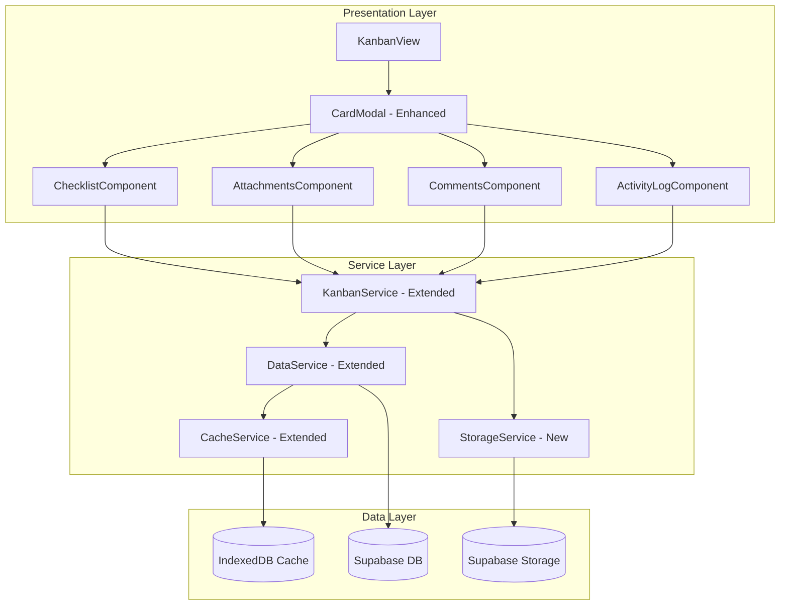
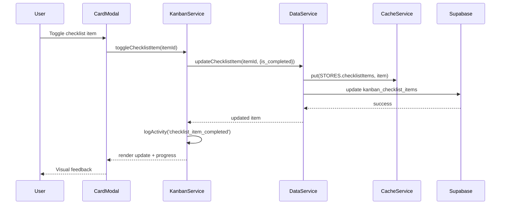
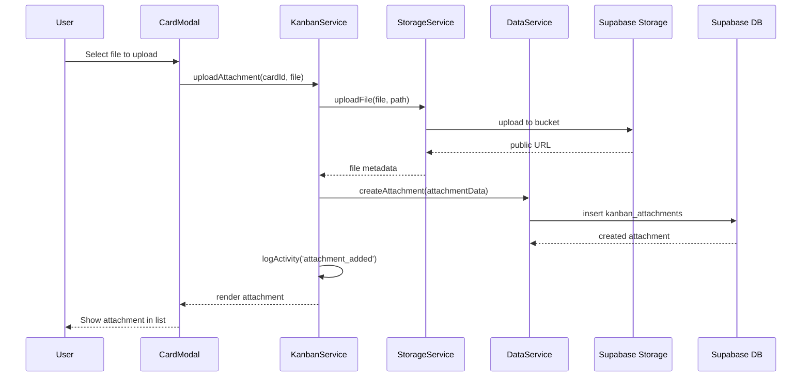

# Design Document: Kanban Card Enhancements

## Overview

This design extends the existing Kanban board implementation with three major card enhancements: checklists/subtasks, file attachments, and comments/activity logging. The design follows established patterns from the existing codebase, using vanilla JavaScript, Supabase for persistence, Supabase Storage for file attachments, and IndexedDB for offline caching.

Key design principles:
- Extend existing `kanban-service.js` and `data-service.js` with new methods
- Add new database tables for checklists, attachments, comments, and activity logs
- Integrate with existing card modal UI pattern
- Support offline-first for text data (checklists, comments, activity) while requiring online for file operations
- Maintain consistency with existing CSS patterns and dark mode support

## Architecture



### Data Flow - Checklist Operations



### Data Flow - Attachment Upload



## Components and Interfaces

### Enhanced Card Modal

The existing card modal will be extended with tabbed sections:

```
┌─────────────────────────────────────────────────────────────────┐
│  Card Title                                              [X]    │
├─────────────────────────────────────────────────────────────────┤
│  [Details] [Checklist (3/5)] [Attachments (2)] [Activity]       │
├─────────────────────────────────────────────────────────────────┤
│                                                                 │
│  ┌─ Checklist ─────────────────────────────────────────────┐   │
│  │ [+] Add item                                             │   │
│  │ ☑ Research API options                                   │   │
│  │ ☑ Write initial implementation                           │   │
│  │ ☐ Add unit tests                                         │   │
│  │ ☐ Update documentation                                   │   │
│  │ ☐ Code review                                            │   │
│  └──────────────────────────────────────────────────────────┘   │
│                                                                 │
│                                    [Delete Card]  [Save]        │
└─────────────────────────────────────────────────────────────────┘
```

### KanbanService Extensions (js/kanban-service.js)

```javascript
class KanbanService {
    // ... existing methods ...
    
    // ==================== CHECKLIST OPERATIONS ====================
    
    /**
     * Get all checklist items for a card
     * @param {string} cardId - Card ID
     * @returns {Promise<Array>} Checklist items sorted by order_index
     */
    async getChecklistItems(cardId) { }
    
    /**
     * Create a new checklist item
     * @param {string} cardId - Card ID
     * @param {string} text - Item text
     * @returns {Promise<Object>} Created checklist item
     */
    async createChecklistItem(cardId, text) { }
    
    /**
     * Update a checklist item
     * @param {string} itemId - Item ID
     * @param {Object} updates - Fields to update (text, is_completed)
     * @returns {Promise<Object>} Updated item
     */
    async updateChecklistItem(itemId, updates) { }
    
    /**
     * Toggle checklist item completion
     * @param {string} itemId - Item ID
     * @returns {Promise<Object>} Updated item with toggled status
     */
    async toggleChecklistItem(itemId) { }
    
    /**
     * Delete a checklist item
     * @param {string} itemId - Item ID
     * @returns {Promise<void>}
     */
    async deleteChecklistItem(itemId) { }
    
    /**
     * Reorder checklist items
     * @param {string} cardId - Card ID
     * @param {Array<string>} itemOrder - Array of item IDs in desired order
     * @returns {Promise<Array>} Updated items
     */
    async reorderChecklistItems(cardId, itemOrder) { }
    
    /**
     * Get checklist progress for a card
     * @param {string} cardId - Card ID
     * @returns {Promise<{completed: number, total: number}>}
     */
    async getChecklistProgress(cardId) { }
    
    // ==================== ATTACHMENT OPERATIONS ====================
    
    /**
     * Get all attachments for a card
     * @param {string} cardId - Card ID
     * @returns {Promise<Array>} Attachments sorted by created_at
     */
    async getAttachments(cardId) { }
    
    /**
     * Upload and create an attachment
     * @param {string} cardId - Card ID
     * @param {File} file - File to upload
     * @param {Function} onProgress - Progress callback (0-100)
     * @returns {Promise<Object>} Created attachment with URL
     */
    async uploadAttachment(cardId, file, onProgress) { }
    
    /**
     * Delete an attachment
     * @param {string} attachmentId - Attachment ID
     * @returns {Promise<void>}
     */
    async deleteAttachment(attachmentId) { }
    
    /**
     * Get attachment count for a card
     * @param {string} cardId - Card ID
     * @returns {Promise<number>}
     */
    async getAttachmentCount(cardId) { }
    
    // ==================== COMMENT OPERATIONS ====================
    
    /**
     * Get all comments for a card
     * @param {string} cardId - Card ID
     * @returns {Promise<Array>} Comments sorted by created_at descending
     */
    async getComments(cardId) { }
    
    /**
     * Create a new comment
     * @param {string} cardId - Card ID
     * @param {string} text - Comment text
     * @returns {Promise<Object>} Created comment
     */
    async createComment(cardId, text) { }
    
    /**
     * Update a comment
     * @param {string} commentId - Comment ID
     * @param {string} text - New text
     * @returns {Promise<Object>} Updated comment with edited_at timestamp
     */
    async updateComment(commentId, text) { }
    
    /**
     * Delete a comment
     * @param {string} commentId - Comment ID
     * @returns {Promise<void>}
     */
    async deleteComment(commentId) { }
    
    /**
     * Get comment count for a card
     * @param {string} cardId - Card ID
     * @returns {Promise<number>}
     */
    async getCommentCount(cardId) { }
    
    // ==================== ACTIVITY LOG OPERATIONS ====================
    
    /**
     * Get activity log for a card
     * @param {string} cardId - Card ID
     * @returns {Promise<Array>} Activity entries sorted by created_at descending
     */
    async getActivityLog(cardId) { }
    
    /**
     * Log an activity entry
     * @param {string} cardId - Card ID
     * @param {string} actionType - Type of action
     * @param {Object} actionData - Additional data about the action
     * @returns {Promise<Object>} Created activity entry
     */
    async logActivity(cardId, actionType, actionData) { }
}
```

### StorageService (js/storage-service.js) - New

```javascript
/**
 * StorageService - Handles file uploads to Supabase Storage
 */
class StorageService {
    constructor() {
        this.supabase = getSupabaseClient();
        this.bucketName = 'kanban-attachments';
        this.maxFileSize = 10 * 1024 * 1024; // 10MB
        this.allowedTypes = [
            'image/jpeg', 'image/png', 'image/gif', 'image/webp',
            'application/pdf', 
            'application/msword',
            'application/vnd.openxmlformats-officedocument.wordprocessingml.document',
            'text/plain', 'text/csv',
            'application/zip'
        ];
    }
    
    /**
     * Upload a file to Supabase Storage
     * @param {File} file - File to upload
     * @param {string} path - Storage path (e.g., 'user-id/card-id/filename')
     * @param {Function} onProgress - Progress callback
     * @returns {Promise<{path: string, url: string}>}
     */
    async uploadFile(file, path, onProgress) { }
    
    /**
     * Delete a file from Supabase Storage
     * @param {string} path - Storage path
     * @returns {Promise<void>}
     */
    async deleteFile(path) { }
    
    /**
     * Get public URL for a file
     * @param {string} path - Storage path
     * @returns {string} Public URL
     */
    getPublicUrl(path) { }
    
    /**
     * Validate file before upload
     * @param {File} file - File to validate
     * @returns {{valid: boolean, error?: string}}
     */
    validateFile(file) { }
}
```

### ChecklistComponent

```javascript
class ChecklistComponent {
    constructor(cardId, container, kanbanService) {
        this.cardId = cardId;
        this.container = container;
        this.kanbanService = kanbanService;
        this.items = [];
        this.dragHandler = null;
    }
    
    async init() { }
    async render() { }
    async addItem(text) { }
    async toggleItem(itemId) { }
    async editItem(itemId, text) { }
    async deleteItem(itemId) { }
    async reorderItems(newOrder) { }
    renderProgressIndicator() { }
    initDragAndDrop() { }
    destroy() { }
}
```

### AttachmentsComponent

```javascript
class AttachmentsComponent {
    constructor(cardId, container, kanbanService) {
        this.cardId = cardId;
        this.container = container;
        this.kanbanService = kanbanService;
        this.attachments = [];
    }
    
    async init() { }
    async render() { }
    async uploadFile(file) { }
    async deleteAttachment(attachmentId) { }
    renderAttachment(attachment) { }
    renderImagePreview(attachment) { }
    openImageModal(attachment) { }
    downloadFile(attachment) { }
    getFileIcon(fileType) { }
    formatFileSize(bytes) { }
    destroy() { }
}
```

### CommentsComponent

```javascript
class CommentsComponent {
    constructor(cardId, container, kanbanService, currentUserId) {
        this.cardId = cardId;
        this.container = container;
        this.kanbanService = kanbanService;
        this.currentUserId = currentUserId;
        this.comments = [];
    }
    
    async init() { }
    async render() { }
    async addComment(text) { }
    async editComment(commentId, text) { }
    async deleteComment(commentId) { }
    renderComment(comment) { }
    formatTimestamp(timestamp) { }
    destroy() { }
}
```

### ActivityLogComponent

```javascript
class ActivityLogComponent {
    constructor(cardId, container, kanbanService) {
        this.cardId = cardId;
        this.container = container;
        this.kanbanService = kanbanService;
        this.activities = [];
    }
    
    async init() { }
    async render() { }
    renderActivityEntry(entry) { }
    formatActivityMessage(entry) { }
    formatTimestamp(timestamp) { }
    destroy() { }
}
```

## Data Models

### Database Schema

```sql
-- ============================================================================
-- KANBAN CHECKLIST ITEMS TABLE
-- ============================================================================
CREATE TABLE IF NOT EXISTS kanban_checklist_items (
    id UUID PRIMARY KEY DEFAULT uuid_generate_v4(),
    card_id UUID REFERENCES kanban_cards(id) ON DELETE CASCADE NOT NULL,
    text TEXT NOT NULL,
    is_completed BOOLEAN DEFAULT FALSE,
    order_index INTEGER NOT NULL DEFAULT 0,
    created_at TIMESTAMP WITH TIME ZONE DEFAULT NOW(),
    updated_at TIMESTAMP WITH TIME ZONE DEFAULT NOW()
);

-- Enable Row Level Security
ALTER TABLE kanban_checklist_items ENABLE ROW LEVEL SECURITY;

-- RLS Policy: Users can access checklist items of their own cards
CREATE POLICY "Users can manage their own checklist items"
    ON kanban_checklist_items FOR ALL
    USING (
        EXISTS (
            SELECT 1 FROM kanban_cards c
            JOIN kanban_boards b ON c.board_id = b.id
            WHERE c.id = kanban_checklist_items.card_id
            AND b.user_id = auth.uid()
        )
    );

-- Indexes
CREATE INDEX idx_checklist_items_card ON kanban_checklist_items(card_id);
CREATE INDEX idx_checklist_items_order ON kanban_checklist_items(card_id, order_index);

-- ============================================================================
-- KANBAN ATTACHMENTS TABLE
-- ============================================================================
CREATE TABLE IF NOT EXISTS kanban_attachments (
    id UUID PRIMARY KEY DEFAULT uuid_generate_v4(),
    card_id UUID REFERENCES kanban_cards(id) ON DELETE CASCADE NOT NULL,
    file_name TEXT NOT NULL,
    file_path TEXT NOT NULL,
    file_type TEXT NOT NULL,
    file_size INTEGER NOT NULL,
    uploaded_by UUID REFERENCES auth.users(id) ON DELETE SET NULL,
    created_at TIMESTAMP WITH TIME ZONE DEFAULT NOW()
);

-- Enable Row Level Security
ALTER TABLE kanban_attachments ENABLE ROW LEVEL SECURITY;

-- RLS Policy: Users can access attachments of their own cards
CREATE POLICY "Users can manage their own attachments"
    ON kanban_attachments FOR ALL
    USING (
        EXISTS (
            SELECT 1 FROM kanban_cards c
            JOIN kanban_boards b ON c.board_id = b.id
            WHERE c.id = kanban_attachments.card_id
            AND b.user_id = auth.uid()
        )
    );

-- Indexes
CREATE INDEX idx_attachments_card ON kanban_attachments(card_id);

-- ============================================================================
-- KANBAN COMMENTS TABLE
-- ============================================================================
CREATE TABLE IF NOT EXISTS kanban_comments (
    id UUID PRIMARY KEY DEFAULT uuid_generate_v4(),
    card_id UUID REFERENCES kanban_cards(id) ON DELETE CASCADE NOT NULL,
    user_id UUID REFERENCES auth.users(id) ON DELETE SET NULL,
    text TEXT NOT NULL,
    edited_at TIMESTAMP WITH TIME ZONE,
    created_at TIMESTAMP WITH TIME ZONE DEFAULT NOW(),
    updated_at TIMESTAMP WITH TIME ZONE DEFAULT NOW()
);

-- Enable Row Level Security
ALTER TABLE kanban_comments ENABLE ROW LEVEL SECURITY;

-- RLS Policy: Users can view comments on their own cards
CREATE POLICY "Users can view comments on their cards"
    ON kanban_comments FOR SELECT
    USING (
        EXISTS (
            SELECT 1 FROM kanban_cards c
            JOIN kanban_boards b ON c.board_id = b.id
            WHERE c.id = kanban_comments.card_id
            AND b.user_id = auth.uid()
        )
    );

-- RLS Policy: Users can insert comments on their own cards
CREATE POLICY "Users can insert comments on their cards"
    ON kanban_comments FOR INSERT
    WITH CHECK (
        EXISTS (
            SELECT 1 FROM kanban_cards c
            JOIN kanban_boards b ON c.board_id = b.id
            WHERE c.id = kanban_comments.card_id
            AND b.user_id = auth.uid()
        )
    );

-- RLS Policy: Users can update their own comments
CREATE POLICY "Users can update their own comments"
    ON kanban_comments FOR UPDATE
    USING (user_id = auth.uid());

-- RLS Policy: Users can delete their own comments
CREATE POLICY "Users can delete their own comments"
    ON kanban_comments FOR DELETE
    USING (user_id = auth.uid());

-- Indexes
CREATE INDEX idx_comments_card ON kanban_comments(card_id);
CREATE INDEX idx_comments_user ON kanban_comments(user_id);

-- ============================================================================
-- KANBAN ACTIVITY LOG TABLE
-- ============================================================================
CREATE TABLE IF NOT EXISTS kanban_activity_log (
    id UUID PRIMARY KEY DEFAULT uuid_generate_v4(),
    card_id UUID REFERENCES kanban_cards(id) ON DELETE CASCADE NOT NULL,
    user_id UUID REFERENCES auth.users(id) ON DELETE SET NULL,
    action_type TEXT NOT NULL,
    action_data JSONB DEFAULT '{}',
    created_at TIMESTAMP WITH TIME ZONE DEFAULT NOW()
);

-- Enable Row Level Security
ALTER TABLE kanban_activity_log ENABLE ROW LEVEL SECURITY;

-- RLS Policy: Users can access activity log of their own cards
CREATE POLICY "Users can view activity log of their cards"
    ON kanban_activity_log FOR SELECT
    USING (
        EXISTS (
            SELECT 1 FROM kanban_cards c
            JOIN kanban_boards b ON c.board_id = b.id
            WHERE c.id = kanban_activity_log.card_id
            AND b.user_id = auth.uid()
        )
    );

-- RLS Policy: Users can insert activity log entries for their own cards
CREATE POLICY "Users can insert activity log entries"
    ON kanban_activity_log FOR INSERT
    WITH CHECK (
        EXISTS (
            SELECT 1 FROM kanban_cards c
            JOIN kanban_boards b ON c.board_id = b.id
            WHERE c.id = kanban_activity_log.card_id
            AND b.user_id = auth.uid()
        )
    );

-- Indexes
CREATE INDEX idx_activity_log_card ON kanban_activity_log(card_id);
CREATE INDEX idx_activity_log_created ON kanban_activity_log(card_id, created_at DESC);

-- ============================================================================
-- SUPABASE STORAGE BUCKET
-- Run this in Supabase Dashboard > Storage > Create new bucket
-- ============================================================================
-- Bucket name: kanban-attachments
-- Public: false (use signed URLs or RLS)
-- File size limit: 10MB
-- Allowed MIME types: image/*, application/pdf, application/msword, 
--                     application/vnd.openxmlformats-officedocument.wordprocessingml.document,
--                     text/plain, text/csv, application/zip
```

### JavaScript Data Structures

```javascript
/**
 * Checklist item structure
 * @typedef {Object} ChecklistItem
 * @property {string} id - UUID
 * @property {string} card_id - Parent card UUID
 * @property {string} text - Item text
 * @property {boolean} is_completed - Completion status
 * @property {number} order_index - Position in list
 * @property {string} created_at - ISO timestamp
 * @property {string} updated_at - ISO timestamp
 */

/**
 * Attachment structure
 * @typedef {Object} Attachment
 * @property {string} id - UUID
 * @property {string} card_id - Parent card UUID
 * @property {string} file_name - Original file name
 * @property {string} file_path - Storage path
 * @property {string} file_type - MIME type
 * @property {number} file_size - Size in bytes
 * @property {string} uploaded_by - User UUID
 * @property {string} created_at - ISO timestamp
 * @property {string} [url] - Computed public URL (not stored)
 */

/**
 * Comment structure
 * @typedef {Object} Comment
 * @property {string} id - UUID
 * @property {string} card_id - Parent card UUID
 * @property {string} user_id - Author UUID
 * @property {string} text - Comment text
 * @property {string} [edited_at] - Edit timestamp if edited
 * @property {string} created_at - ISO timestamp
 * @property {string} updated_at - ISO timestamp
 */

/**
 * Activity log entry structure
 * @typedef {Object} ActivityEntry
 * @property {string} id - UUID
 * @property {string} card_id - Parent card UUID
 * @property {string} user_id - Actor UUID
 * @property {string} action_type - Type of action
 * @property {Object} action_data - Additional action details
 * @property {string} created_at - ISO timestamp
 */

/**
 * Activity action types
 * @enum {string}
 */
const ACTIVITY_TYPES = {
    CARD_CREATED: 'card_created',
    CARD_MOVED: 'card_moved',
    CARD_EDITED: 'card_edited',
    CHECKLIST_ITEM_ADDED: 'checklist_item_added',
    CHECKLIST_ITEM_COMPLETED: 'checklist_item_completed',
    CHECKLIST_ITEM_UNCOMPLETED: 'checklist_item_uncompleted',
    CHECKLIST_ITEM_DELETED: 'checklist_item_deleted',
    ATTACHMENT_ADDED: 'attachment_added',
    ATTACHMENT_DELETED: 'attachment_deleted',
    COMMENT_ADDED: 'comment_added',
    COMMENT_EDITED: 'comment_edited',
    COMMENT_DELETED: 'comment_deleted'
};

/**
 * Card preview metadata (for board view)
 * @typedef {Object} CardPreviewMeta
 * @property {{completed: number, total: number}} checklist - Checklist progress
 * @property {number} attachmentCount - Number of attachments
 * @property {number} commentCount - Number of comments
 */
```

### Cache Store Extensions

```javascript
// Add to cache-service.js STORES object
const STORES = {
    // ... existing stores ...
    checklistItems: 'checklist_items',
    attachments: 'attachments',  // Metadata only, not file contents
    comments: 'comments',
    activityLog: 'activity_log'
};

// Add to CACHE_TTL object
const CACHE_TTL = {
    // ... existing TTLs ...
    checklistItems: 5 * 60 * 1000,    // 5 minutes
    attachments: 30 * 60 * 1000,       // 30 minutes (metadata only)
    comments: 5 * 60 * 1000,           // 5 minutes
    activityLog: 5 * 60 * 1000         // 5 minutes
};
```


## Correctness Properties

*A property is a characteristic or behavior that should hold true across all valid executions of a system—essentially, a formal statement about what the system should do. Properties serve as the bridge between human-readable specifications and machine-verifiable correctness guarantees.*

### Property 1: Checklist Item Creation Completeness

*For any* valid non-empty text input, creating a checklist item SHALL produce an item with the provided text, is_completed=false, a valid card_id, sequential order_index, and valid timestamps.

**Validates: Requirements 1.2, 1.4**

### Property 2: Empty Input Rejection

*For any* string composed entirely of whitespace (including empty string), attempting to create a checklist item or comment SHALL be rejected and the existing data SHALL remain unchanged.

**Validates: Requirements 1.3, 8.3**

### Property 3: Checklist Item Edit Round-Trip

*For any* checklist item and any valid new text, updating the item's text and then fetching it SHALL return the updated text value.

**Validates: Requirements 1.5**

### Property 4: Checklist Order Index Invariant

*For any* card's checklist after any sequence of add, delete, or reorder operations, the order indices SHALL be sequential integers starting from 0 with no gaps or duplicates.

**Validates: Requirements 1.6, 4.2, 4.3**

### Property 5: Checklist Toggle Round-Trip

*For any* checklist item, toggling its completion status and then fetching it SHALL return the toggled value. Toggling twice SHALL return to the original state.

**Validates: Requirements 2.1, 2.5**

### Property 6: Checklist Progress Calculation

*For any* card with N checklist items where M are completed, the progress indicator SHALL show exactly "M/N items done" where M equals the count of items with is_completed=true.

**Validates: Requirements 2.3, 3.1**

### Property 7: Attachment Path Uniqueness

*For any* two file uploads (even with identical file names), the generated storage paths SHALL be unique.

**Validates: Requirements 5.2**

### Property 8: Attachment Record Completeness

*For any* successfully uploaded file, the created attachment record SHALL contain card_id, file_name matching the original, file_path, file_type matching the MIME type, file_size matching the actual size, and uploaded_by matching the current user.

**Validates: Requirements 5.3**

### Property 9: File Type Validation

*For any* file with a MIME type in the allowed list (images, PDFs, documents, text, CSV, ZIP), upload SHALL be accepted. *For any* file with a MIME type not in the allowed list, upload SHALL be rejected.

**Validates: Requirements 5.6**

### Property 10: File Size Validation

*For any* file with size greater than 10MB, upload SHALL be rejected with an appropriate error. *For any* file with size 10MB or less (and valid type), upload SHALL be accepted.

**Validates: Requirements 5.7**

### Property 11: Image Attachment Thumbnail

*For any* attachment with file_type starting with "image/", the rendered attachment SHALL include a thumbnail preview element.

**Validates: Requirements 6.2**

### Property 12: Attachment Metadata Display

*For any* attachment, the rendered display SHALL include the file_name, a file type icon appropriate to the file_type, and the file_size formatted in human-readable units.

**Validates: Requirements 6.6**

### Property 13: Attachment Deletion from Storage

*For any* attachment, after confirmed deletion, attempting to access the file at file_path in Supabase Storage SHALL return not found.

**Validates: Requirements 7.2**

### Property 14: Attachment Deletion from Database

*For any* attachment, after confirmed deletion, querying for that attachment ID SHALL return null/not found.

**Validates: Requirements 7.3**

### Property 15: Comment Creation Completeness

*For any* valid non-empty comment text, creating a comment SHALL produce a comment with the provided text, user_id matching the current user, and valid created_at timestamp.

**Validates: Requirements 8.2**

### Property 16: Comment Chronological Order

*For any* card with multiple comments, fetching comments SHALL return them sorted by created_at in descending order (newest first).

**Validates: Requirements 8.5**

### Property 17: Comment Edit Timestamp

*For any* comment that is edited, the updated comment SHALL have an edited_at timestamp that is greater than or equal to the original created_at timestamp.

**Validates: Requirements 9.2**

### Property 18: Comment Deletion

*For any* comment, after deletion, querying for that comment ID SHALL return null/not found.

**Validates: Requirements 9.3**

### Property 19: Comment Ownership Authorization

*For any* comment, edit and delete operations SHALL only succeed when the requesting user_id matches the comment's user_id.

**Validates: Requirements 9.4**

### Property 20: Activity Entry Creation on Card Events

*For any* card creation, the activity log SHALL contain an entry with action_type='card_created'. *For any* card move between columns, the activity log SHALL contain an entry with action_type='card_moved' and action_data containing source and target column information.

**Validates: Requirements 10.2, 10.3**

### Property 21: Activity Entry Creation on Checklist Events

*For any* checklist item addition, completion, or deletion, the activity log SHALL contain a corresponding entry with the appropriate action_type.

**Validates: Requirements 10.5**

### Property 22: Activity Entry Creation on Attachment Events

*For any* attachment addition or deletion, the activity log SHALL contain a corresponding entry with action_type='attachment_added' or 'attachment_deleted'.

**Validates: Requirements 10.6**

### Property 23: Activity Entry Completeness

*For any* activity entry, it SHALL contain card_id, action_type, action_data (object), user_id, and created_at timestamp.

**Validates: Requirements 10.7, 11.1**

### Property 24: Activity Log Chronological Order

*For any* card with multiple activity entries, fetching the activity log SHALL return entries sorted by created_at in descending order (newest first).

**Validates: Requirements 10.8**

### Property 25: Activity Entry Serialization Round-Trip

*For any* valid activity entry object, serializing to JSON and then deserializing SHALL produce an object equivalent to the original.

**Validates: Requirements 11.4**

### Property 26: Card Preview Metadata Accuracy

*For any* card displayed in the board view, the checklist progress shown SHALL match the actual completed/total count, the attachment count SHALL match the actual number of attachments, and the comment count SHALL match the actual number of comments.

**Validates: Requirements 12.1**

### Property 27: Offline Operation Queueing

*For any* create, update, or delete operation on checklists, comments, or activity entries performed while offline, the operation SHALL be added to the pending sync queue with appropriate type, store, and data.

**Validates: Requirements 1.7, 8.6, 9.5, 11.3**

### Property 28: Cache Population

*For any* fetch of checklist items, comments, or activity entries, the returned data SHALL also be stored in the corresponding IndexedDB cache store.

**Validates: Requirements 13.2**

### Property 29: Attachment Content Not Cached

*For any* attachment, only the metadata (id, card_id, file_name, file_path, file_type, file_size) SHALL be stored in IndexedDB cache, never the actual file contents.

**Validates: Requirements 13.3**

### Property 30: Conflict Resolution by Timestamp

*For any* sync conflict between local and server versions of the same entity, the version with the more recent updated_at timestamp SHALL be preserved.

**Validates: Requirements 13.5**

## Error Handling

### Network Errors

```javascript
async function handleNetworkError(operation, error) {
    if (!navigator.onLine) {
        // For read operations, return cached data
        if (operation.type === 'read') {
            const cached = await cacheService.getAll(operation.store);
            if (cached.length > 0) {
                Toast.warning('You are offline. Showing cached data.');
                return cached;
            }
        }
        
        // For write operations on cacheable data, queue for sync
        if (['checklist', 'comment', 'activity'].includes(operation.entity)) {
            await cacheService.addPendingSync({
                type: operation.type,
                store: operation.store,
                data: operation.data
            });
            Toast.warning('You are offline. Changes will sync when connected.');
            return { queued: true };
        }
        
        // For attachment operations, block and notify
        if (operation.entity === 'attachment') {
            Toast.error('Attachment operations require an internet connection.');
            throw new Error('Offline - attachment operations not available');
        }
    }
    
    console.error(`${operation.entity} ${operation.type} failed:`, error);
    Toast.error(`Failed to ${operation.type} ${operation.entity}. Please try again.`);
    throw error;
}
```

### Validation Errors

```javascript
function validateChecklistItem(item) {
    const errors = [];
    if (!item.text?.trim()) {
        errors.push('Checklist item text is required');
    }
    if (item.text?.length > 500) {
        errors.push('Checklist item text must be 500 characters or less');
    }
    return errors;
}

function validateComment(comment) {
    const errors = [];
    if (!comment.text?.trim()) {
        errors.push('Comment text is required');
    }
    if (comment.text?.length > 2000) {
        errors.push('Comment must be 2000 characters or less');
    }
    return errors;
}

function validateAttachment(file) {
    const errors = [];
    const maxSize = 10 * 1024 * 1024; // 10MB
    const allowedTypes = [
        'image/jpeg', 'image/png', 'image/gif', 'image/webp',
        'application/pdf',
        'application/msword',
        'application/vnd.openxmlformats-officedocument.wordprocessingml.document',
        'text/plain', 'text/csv',
        'application/zip'
    ];
    
    if (file.size > maxSize) {
        errors.push('File size must be 10MB or less');
    }
    if (!allowedTypes.includes(file.type)) {
        errors.push('File type not supported');
    }
    return errors;
}
```

### Upload Error Recovery

```javascript
async function handleUploadError(file, error, retryCount = 0) {
    const maxRetries = 3;
    
    if (retryCount < maxRetries && error.message.includes('network')) {
        Toast.warning(`Upload failed. Retrying... (${retryCount + 1}/${maxRetries})`);
        await new Promise(resolve => setTimeout(resolve, 1000 * (retryCount + 1)));
        return await this.uploadAttachment(file, retryCount + 1);
    }
    
    Toast.error('Failed to upload file. Please try again.');
    throw error;
}
```

### Drag-and-Drop Error Recovery

```javascript
async function handleReorderError(cardId, originalOrder, error) {
    console.error('Reorder operation failed:', error);
    
    // Restore original order in cache
    for (let i = 0; i < originalOrder.length; i++) {
        const item = await cacheService.get(STORES.checklistItems, originalOrder[i]);
        if (item) {
            await cacheService.put(STORES.checklistItems, { ...item, order_index: i });
        }
    }
    
    // Re-render with original order
    await this.render();
    
    Toast.error('Failed to reorder items. Please try again.');
}
```

## Testing Strategy

### Unit Tests

Unit tests focus on specific examples, edge cases, and error conditions:

- Checklist item CRUD with valid and invalid inputs
- Comment CRUD with ownership validation
- Attachment validation (file type, file size)
- Progress calculation with various completion states
- Activity log entry creation for each action type
- Timestamp formatting functions
- File size formatting functions

### Property-Based Tests

Property-based tests verify universal properties across randomly generated inputs. Each property test should run a minimum of 100 iterations.

**Testing Library**: Use `fast-check` for JavaScript property-based testing.

**Test Configuration**:
```javascript
import fc from 'fast-check';

const testConfig = { numRuns: 100 };
```

**Property Test Examples**:

```javascript
// Feature: kanban-card-enhancements, Property 4: Checklist Order Index Invariant
describe('Checklist Order Index', () => {
    it('maintains sequential indices after operations', () => {
        fc.assert(
            fc.property(
                fc.array(fc.record({
                    id: fc.uuid(),
                    text: fc.string({ minLength: 1, maxLength: 100 }),
                    is_completed: fc.boolean(),
                    order_index: fc.nat()
                }), { minLength: 1, maxLength: 20 }),
                fc.array(fc.oneof(
                    fc.constant({ type: 'add', text: fc.string({ minLength: 1 }) }),
                    fc.constant({ type: 'delete' }),
                    fc.constant({ type: 'reorder' })
                ), { maxLength: 10 }),
                (initialItems, operations) => {
                    let items = [...initialItems];
                    
                    // Apply operations
                    for (const op of operations) {
                        items = applyOperation(items, op);
                    }
                    
                    // Verify sequential indices
                    const sortedItems = items.sort((a, b) => a.order_index - b.order_index);
                    return sortedItems.every((item, idx) => item.order_index === idx);
                }
            ),
            testConfig
        );
    });
});

// Feature: kanban-card-enhancements, Property 5: Checklist Toggle Round-Trip
describe('Checklist Toggle', () => {
    it('toggling twice returns to original state', () => {
        fc.assert(
            fc.property(
                fc.record({
                    id: fc.uuid(),
                    text: fc.string({ minLength: 1 }),
                    is_completed: fc.boolean()
                }),
                (item) => {
                    const original = item.is_completed;
                    const afterFirstToggle = !original;
                    const afterSecondToggle = !afterFirstToggle;
                    
                    return afterSecondToggle === original;
                }
            ),
            testConfig
        );
    });
});

// Feature: kanban-card-enhancements, Property 6: Checklist Progress Calculation
describe('Checklist Progress', () => {
    it('correctly calculates completed/total', () => {
        fc.assert(
            fc.property(
                fc.array(fc.record({
                    id: fc.uuid(),
                    is_completed: fc.boolean()
                }), { minLength: 0, maxLength: 50 }),
                (items) => {
                    const total = items.length;
                    const completed = items.filter(i => i.is_completed).length;
                    const progress = calculateProgress(items);
                    
                    return progress.completed === completed && progress.total === total;
                }
            ),
            testConfig
        );
    });
});

// Feature: kanban-card-enhancements, Property 16: Comment Chronological Order
describe('Comment Ordering', () => {
    it('returns comments in reverse chronological order', () => {
        fc.assert(
            fc.property(
                fc.array(fc.record({
                    id: fc.uuid(),
                    text: fc.string({ minLength: 1 }),
                    created_at: fc.date({ min: new Date('2020-01-01'), max: new Date('2030-01-01') })
                }), { minLength: 2, maxLength: 20 }),
                (comments) => {
                    const sorted = sortComments(comments);
                    
                    // Verify each comment is newer than or equal to the next
                    for (let i = 0; i < sorted.length - 1; i++) {
                        if (new Date(sorted[i].created_at) < new Date(sorted[i + 1].created_at)) {
                            return false;
                        }
                    }
                    return true;
                }
            ),
            testConfig
        );
    });
});

// Feature: kanban-card-enhancements, Property 25: Activity Entry Serialization Round-Trip
describe('Activity Entry Serialization', () => {
    it('round-trip preserves activity data', () => {
        fc.assert(
            fc.property(
                fc.record({
                    id: fc.uuid(),
                    card_id: fc.uuid(),
                    user_id: fc.uuid(),
                    action_type: fc.constantFrom(
                        'card_created', 'card_moved', 'card_edited',
                        'checklist_item_added', 'checklist_item_completed',
                        'attachment_added', 'comment_added'
                    ),
                    action_data: fc.dictionary(fc.string(), fc.jsonValue()),
                    created_at: fc.date().map(d => d.toISOString())
                }),
                (entry) => {
                    const serialized = JSON.stringify(entry);
                    const deserialized = JSON.parse(serialized);
                    return deepEqual(entry, deserialized);
                }
            ),
            testConfig
        );
    });
});

// Feature: kanban-card-enhancements, Property 2: Empty Input Rejection
describe('Empty Input Validation', () => {
    it('rejects whitespace-only checklist items', () => {
        fc.assert(
            fc.property(
                fc.stringOf(fc.constantFrom(' ', '\t', '\n', '\r')),
                (whitespaceText) => {
                    const errors = validateChecklistItem({ text: whitespaceText });
                    return errors.length > 0 && errors.includes('Checklist item text is required');
                }
            ),
            testConfig
        );
    });
});
```

### Integration Tests

- Checklist operations with card modal lifecycle
- Attachment upload/download flow with Supabase Storage
- Activity log generation across all card operations
- Offline mode: queue operations, sync on reconnect
- Card preview metadata updates after checklist/attachment/comment changes

### Accessibility Tests

- Keyboard navigation through checklist items
- Screen reader announcements for progress changes
- Focus management in attachment upload flow
- ARIA labels for action buttons
- Color contrast for completion indicators
